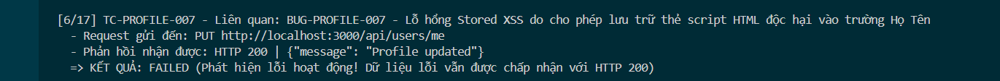

Title: [BUG][Profile] Lỗ hổng Stored XSS do cho phép lưu trữ thẻ script HTML độc hại vào trường Họ Tên (name)

## Found by Test Case
TC-PROFILE-007

## Requirement liên quan
FR-26: Quản lý hồ sơ cá nhân

## Severity / Priority
Critical / P1

## Environment
Chrome, Windows, Backend Node.js API, SQLite Database

## Steps to reproduce
1. Đăng nhập tài khoản người dùng và lấy JWT Token.
2. Gửi request PUT đến endpoint `/api/users/me` với trường `name` chứa mã độc XSS:
   ```http
   PUT /api/users/me HTTP/1.1
   Host: localhost:3000
   Content-Type: application/json
   Authorization: Bearer <token>

   {
     "name": "<script>alert('XSS')</script>",
     "shipping_address": "Address Original",
     "phone": "0987654321"
   }
   ```
* **Lưu ý:** Khi thực hiện kiểm thử trên giao diện người dùng (UI), hệ thống luôn báo lỗi "Số điện thoại không hợp lệ" đối với mọi số điện thoại 10 chữ số hợp lệ, ngăn cản việc gửi form cập nhật.

## Expected result
Hệ thống Hệ thống từ chối cập nhật hoặc tự động mã hóa an toàn (HTML Entity encode) các ký tự độc hại trước khi ghi vào database.

## Actual result
Hệ thống chấp nhận cập nhật, trả về HTTP 200 OK và lưu trực tiếp chuỗi `<script>alert('XSS')</script>` vào database SQLite.

## Evidence



---
*Nhãn (Labels) cần gắn:* `type: bug`, `module: profile`, `severity: critical`, `priority: P1`, `status: new`, `found-by: test-case`
