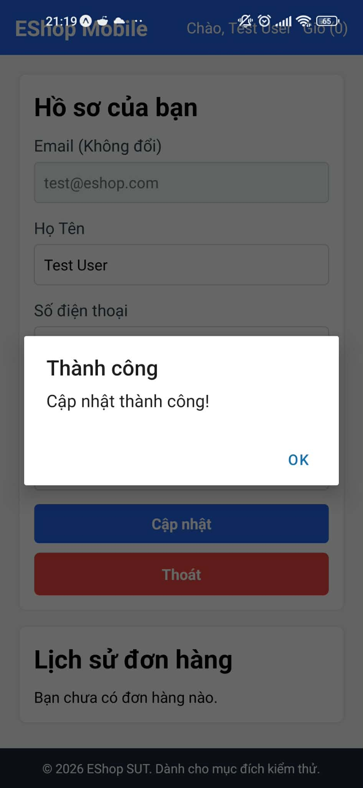

Title: [BUG][Profile] Thiếu validate đầu số điện thoại (phải bắt đầu bằng số 0)

## Found by Test Case
TC-PROFILE-010

## Requirement liên quan
FR-26: Quản lý hồ sơ cá nhân

## Severity / Priority
Medium / P2

## Environment
Chrome, Windows, Backend Node.js API, SQLite Database

## Steps to reproduce
1. Truy cập giao diện trang Cá nhân (sau khi đăng nhập).
2. Nhập số điện thoại không bắt đầu bằng số 0 (ví dụ: "1912345678") vào ô Số điện thoại.
3. Nhập Họ tên và Địa chỉ hợp lệ.
4. Nhấn nút "Cập nhật".

## Expected result
Hệ thống Hệ thống từ chối cập nhật, trả về HTTP 400 Bad Request và báo lỗi Số điện thoại không hợp lệ (phải bắt đầu bằng số 0).

## Actual result
Hệ thống chấp nhận cập nhật, trả về HTTP 200 OK và lưu số điện thoại bắt đầu bằng số 1 vào database.

## Evidence

---
*Nhãn (Labels) cần gắn:* `type: bug`, `module: profile`, `severity: medium`, `priority: P2`, `status: new`, `found-by: test-case`
