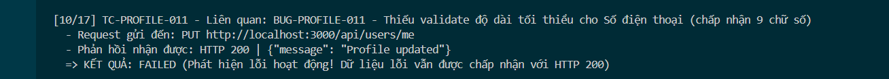

Title: [BUG][Profile] Thiếu validate độ dài tối thiểu cho Số điện thoại (chấp nhận 9 chữ số)

## Found by Test Case
TC-PROFILE-011

## Requirement liên quan
FR-26: Quản lý hồ sơ cá nhân

## Severity / Priority
Low / P3

## Environment
Chrome, Windows, Backend Node.js API, SQLite Database

## Steps to reproduce
1. Đăng nhập tài khoản người dùng và lấy JWT Token.
2. Gửi request PUT đến endpoint `/api/users/me` với trường `phone: "091234567"`:
   ```http
   PUT /api/users/me HTTP/1.1
   Host: localhost:3000
   Content-Type: application/json
   Authorization: Bearer <token>

   {
     "name": "Nguyen Van A",
     "shipping_address": "Address Original",
     "phone": "091234567"
   }
   ```

## Expected result
Hệ thống Hệ thống từ chối cập nhật, trả về HTTP 400 Bad Request và báo lỗi Số điện thoại phải dài từ 10-11 chữ số.

## Actual result
Hệ thống chấp nhận cập nhật, trả về HTTP 200 OK và lưu số điện thoại 9 số vào database.

## Evidence


---
*Nhãn (Labels) cần gắn:* `type: bug`, `module: profile`, `severity: low`, `priority: P3`, `status: new`, `found-by: test-case`
