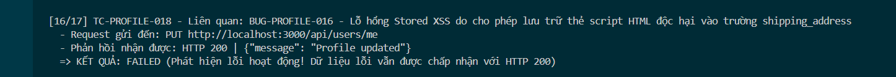

Title: [BUG][Profile] Lỗ hổng Stored XSS do cho phép lưu trữ thẻ script HTML độc hại vào trường Địa chỉ giao hàng (shipping_address)

## Found by Test Case
TC-PROFILE-018

## Requirement liên quan
FR-26: Quản lý hồ sơ cá nhân

## Severity / Priority
Critical / P1

## Environment
Chrome, Windows, Backend Node.js API, SQLite Database

## Steps to reproduce
1. Đăng nhập tài khoản người dùng và lấy JWT Token.
2. Gửi request PUT đến endpoint `/api/users/me` với trường `shipping_address` chứa mã script XSS:
   ```http
   PUT /api/users/me HTTP/1.1
   Host: localhost:3000
   Content-Type: application/json
   Authorization: Bearer <token>

   {
     "name": "Nguyen Van A",
     "shipping_address": "<script>alert('XSS_addr')</script>",
     "phone": "0987654321"
   }
   ```

## Expected result
Hệ thống Hệ thống từ chối cập nhật hoặc tự động mã hóa an toàn (HTML Entity encode) trước khi ghi database.

## Actual result
Hệ thống chấp nhận cập nhật, trả về HTTP 200 OK và lưu trực tiếp chuỗi `<script>alert('XSS_addr')</script>` vào database SQLite.

## Evidence


---
*Nhãn (Labels) cần gắn:* `type: bug`, `module: profile`, `severity: critical`, `priority: P1`, `status: new`, `found-by: test-case`
