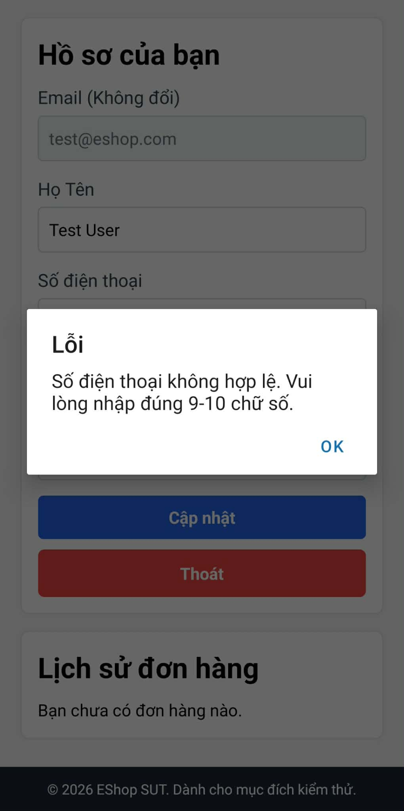

Title: [BUG][Profile] Giao diện trang cá nhân báo lỗi 'Số điện thoại không hợp lệ' đối với mọi số điện thoại 10 chữ số hợp lệ

## Found by Test Case
TC-PROFILE-001

## Requirement liên quan
FR-26: Quản lý hồ sơ cá nhân

## Severity / Priority
Major / P2

## Environment
Chrome, Windows, EShop Frontend & Backend

## Steps to reproduce
1. Đăng nhập tài khoản user.
2. Truy cập giao diện trang cá nhân (Personal Profile).
3. Nhập số điện thoại 10 chữ số hợp lệ (ví dụ: "0912345678").
4. Nhấn nút "Cập nhật".

## Expected result
Hệ thống cho phép cập nhật thông tin thành công và lưu vào CSDL.

## Actual result
Giao diện người dùng hiển thị thông báo lỗi "Số điện thoại không hợp lệ" và ngăn chặn hành vi cập nhật, mặc dù định dạng số điện thoại hoàn toàn hợp lệ.

## Evidence

---
*Nhãn (Labels) cần gắn:* `type: bug`, `module: profile`, `severity: major`, `priority: P2`, `status: new`, `found-by: test-case`
