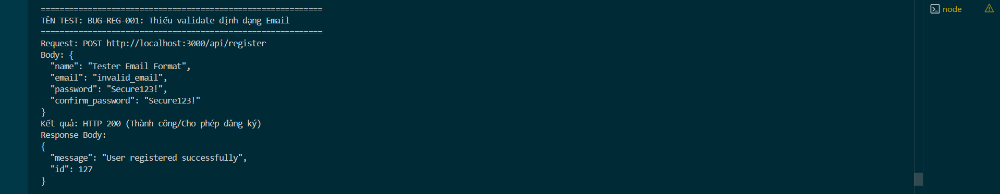

Title: [BUG][Register] Thiếu validate định dạng Email
## Found by Test Case
TC-REG-003, TC-REG-020, TC-REG-021, TC-REG-022, TC-REG-023, TC-REG-024, TC-REG-025, TC-REG-026, TC-REG-027, TC-REG-028, TC-REG-029, TC-REG-030, TC-REG-032, TC-REG-033, TC-REG-034
## Requirement liên quan
FR-01: Account registration (Email phải có định dạng hợp lệ user@domain.com)
## Severity / Priority
Critical / P0
## Environment
Backend Node.js API, SQLite Database
## Steps to reproduce
1. Gửi cuộc gọi API POST đến `/api/register` với email không hợp lệ (Ví dụ: `"email": "invalid_email"` hoặc `"userdomain.com"` hoặc `"user@"`):
   ```json
   {
     "name": "Tester Email Format",
     "email": "invalid_email",
     "password": "Secure123!",
     "confirm_password": "Secure123!"
   }
   ```
## Expected result
- Hệ thống từ chối đăng ký, trả về HTTP 400 Bad Request.
- Hiển thị thông báo lỗi cụ thể: "Email không hợp lệ".
## Actual result
- Hệ thống trả về HTTP 200 OK và đăng ký thành công.
- Lưu trữ email sai định dạng trực tiếp vào database.
## Evidence


---
*Nhãn (Labels) cần gắn:* `type: bug`, `module: register`, `severity: critical`, `priority: P0`, `status: new`, `found-by: test-case`
