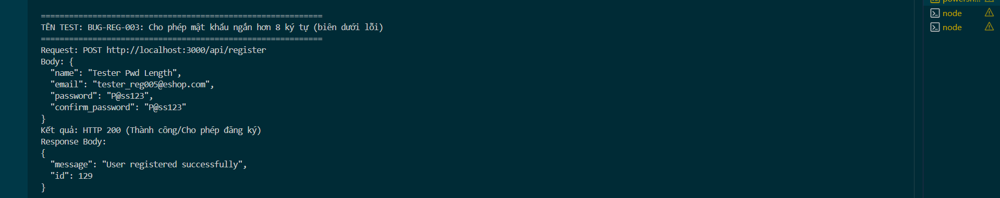

Title: [BUG][Register] Cho phép mật khẩu ngắn hơn 8 ký tự (biên dưới lỗi)

## Found by Test Case
TC-REG-005

## Requirement liên quan
FR-01: Account registration (Yêu cầu mật khẩu mạnh: Tối thiểu 8 ký tự)

## Severity / Priority
Major / P1

## Environment
Backend Node.js API, SQLite Database

## Steps to reproduce
1. Gửi yêu cầu đăng ký API POST đến `/api/register` với mật khẩu ngắn hơn 8 ký tự (Ví dụ: `"password": "P@ss123"`):
   ```json
   {
     "name": "Tester Pwd Length",
     "email": "tester_reg005@eshop.com",
     "password": "P@ss123",
     "confirm_password": "P@ss123"
   }
   ```

## Expected result
- Hệ thống từ chối và trả về HTTP 400 kèm lỗi cụ thể.

## Actual result
- Hệ thống chấp nhận đăng ký thành công và trả về HTTP 200.

## Evidence


---
*Nhãn (Labels) cần gắn:* `type: bug`, `module: register`, `severity: major`, `priority: P1`, `status: new`, `found-by: test-case`
