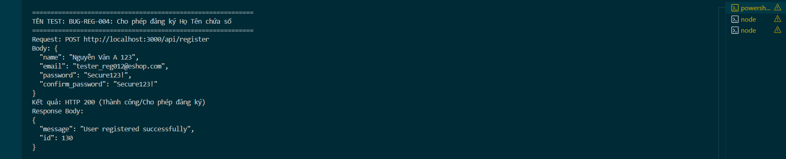

Title: [BUG][Register] Cho phép mật khẩu ngắn hơn 8 ký tự (biên dưới lỗi)
## Found by Test Case
TC-REG-005
## Requirement liên quan
FR-01: Account registration (Yêu cầu mật khẩu mạnh tối thiểu 8 ký tự)
## Severity / Priority
Critical / P0
## Environment
Backend Node.js API, SQLite Database
## Steps to reproduce
1. Gọi API POST đăng ký đến `/api/register` với mật khẩu dài 7 ký tự (Ví dụ: `"password": "P@ss123"`):
   ```json
   {
     "name": "Tester Pwd Length",
     "email": "tester_reg005@eshop.com",
     "password": "P@ss123",
     "confirm_password": "P@ss123"
   }
   ```
## Expected result
- Hệ thống từ chối đăng ký, trả về HTTP 400 Bad Request.
- Hiển thị thông báo lỗi cụ thể: "Mật khẩu phải chứa ít nhất 8 ký tự".
## Actual result
- Hệ thống trả về HTTP 200 OK và đăng ký tài khoản thành công.
## Evidence


---
*Nhãn (Labels) cần gắn:* `type: bug`, `module: register`, `severity: critical`, `priority: P0`, `status: new`, `found-by: test-case`