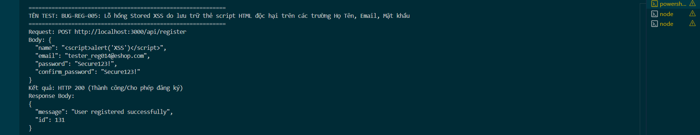

Title: [BUG][Register] Lỗ hổng Stored XSS do lưu trữ thẻ script HTML độc hại trên các trường Họ Tên, Email, Mật khẩu
## Found by Test Case
TC-REG-014, TC-REG-035, TC-REG-037, TC-REG-039
## Requirement liên quan
FR-01: Account registration (Hệ thống từ chối áp dụng, báo lỗi và mã hóa không cho thực thi script XSS)
## Severity / Priority
Critical / P0
## Environment
Backend Node.js API, SQLite Database
## Steps to reproduce
1. Gọi API POST đến `/api/register` với Họ Tên chứa thẻ script HTML độc hại (Ví dụ: `"name": "<script>alert('XSS')</script>"`):
   ```json
   {
     "name": "<script>alert('XSS')</script>",
     "email": "tester_reg014@eshop.com",
     "password": "Secure123!",
     "confirm_password": "Secure123!"
   }
   ```
2. Gọi tương tự với các trường `email` hoặc `password`/`confirm_password` chứa script XSS.
## Expected result
- Hệ thống từ chối đăng ký, trả về HTTP 400 Bad Request.
- Hệ thống mã hóa (encode) hoặc loại bỏ (sanitize) thẻ script HTML độc hại trước khi ghi nhận để tránh lỗ hổng Stored XSS ở Frontend.
## Actual result
- Hệ thống trả về HTTP 200 OK và đăng ký thành công.
- Lưu nguyên văn mã script `<script>alert('XSS')</script>` vào database, sẵn sàng kích hoạt lỗ hổng Stored XSS khi hiển thị thông tin này tại trang quản trị (Admin panel) hoặc hồ sơ người dùng.
## Evidence


---
*Nhãn (Labels) cần gắn:* `type: bug`, `module: register`, `severity: critical`, `priority: P0`, `status: new`, `found-by: test-case`