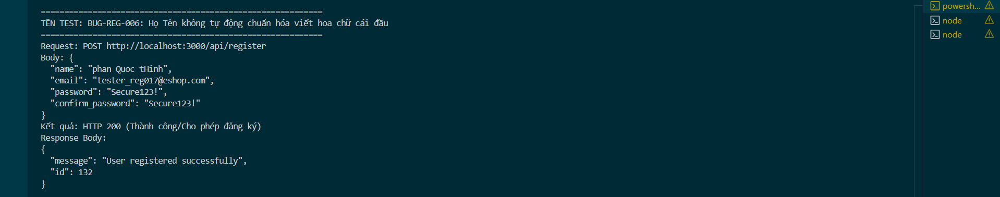

Title: [BUG][Register] Họ Tên không tự động chuẩn hóa viết hoa chữ cái đầu

## Found by Test Case
TC-REG-017

## Requirement liên quan
FR-01: Account registration (Họ Tên tự động chuẩn hóa thành chữ viết hoa đầu từ hoặc báo lỗi yêu cầu định dạng đúng)

## Severity / Priority
Minor / P3

## Environment
Backend Node.js API, SQLite Database

## Steps to reproduce
1. Gọi API POST đăng ký đến `/api/register` với Họ Tên viết hoa chưa chuẩn (Ví dụ: `"name": "phan Quoc tHinh"`):
   ```json
   {
     "name": "phan Quoc tHinh",
     "email": "tester_reg017@eshop.com",
     "password": "Secure123!",
     "confirm_password": "Secure123!"
   }
   ```

## Expected result
- Họ tên trong CSDL tự động được chuẩn hóa thành dạng viết hoa chữ cái đầu của mỗi từ (Ví dụ: `"Phan Quốc Thịnh"` hoặc `"Phan Quoc Thinh"`), hoặc hệ thống trả về HTTP 400 Bad Request yêu cầu nhập đúng định dạng.

## Actual result
- Hệ thống trả về HTTP 200 OK và đăng ký thành công.
- Lưu nguyên văn chuỗi chưa chuẩn hóa `"phan Quoc tHinh"` vào database, gây mất nhất quán dữ liệu.

## Evidence


---
*Nhãn (Labels) cần gắn:* `type: bug`, `module: register`, `severity: minor`, `priority: P3`, `status: new`, `found-by: test-case`
