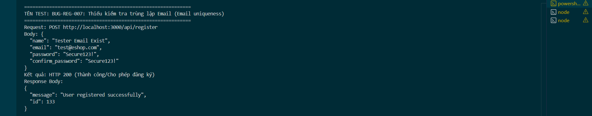

Title: [BUG][Register] Thiếu kiểm tra trùng lặp Email (Email uniqueness)

## Found by Test Case
TC-REG-004

## Requirement liên quan
FR-01: Account registration (Email là duy nhất trong hệ thống)

## Severity / Priority
Critical / P0

## Environment
Backend Node.js API, SQLite Database

## Steps to reproduce
1. Gọi API POST đến `/api/register` để đăng ký với email đã tồn tại sẵn trong hệ thống (Ví dụ: `"test@eshop.com"`):
   ```json
   {
     "name": "Tester Email Exist",
     "email": "test@eshop.com",
     "password": "Secure123!",
     "confirm_password": "Secure123!"
   }
   ```

## Expected result
- Hệ thống từ chối đăng ký, trả về HTTP 409 Conflict hoặc 400 Bad Request.
- Hiển thị thông báo lỗi cụ thể: "Email đã được sử dụng".

## Actual result
- Hệ thống trả về HTTP 200 OK và đăng ký thành công.
- Cơ sở dữ liệu SQLite ghi nhận thêm một bản ghi có email trùng lặp.

## Evidence


---
*Nhãn (Labels) cần gắn:* `type: bug`, `module: register`, `severity: critical`, `priority: P0`, `status: new`, `found-by: test-case`
