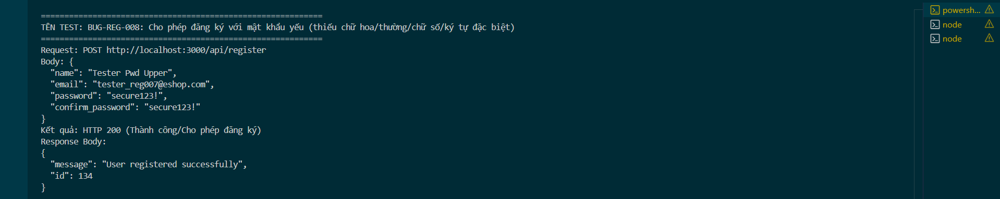

Title: [BUG][Register] Cho phép đăng ký với mật khẩu yếu (thiếu chữ hoa/thường/chữ số/ký tự đặc biệt)

## Found by Test Case
TC-REG-007, TC-REG-008, TC-REG-009, TC-REG-010

## Requirement liên quan
FR-01: Account registration (Mật khẩu mạnh: có ít nhất 1 chữ hoa, 1 chữ thường, 1 chữ số và 1 ký tự đặc biệt trong tập [@, $, !, %, *, ?, &])

## Severity / Priority
Critical / P0

## Environment
Backend Node.js API, SQLite Database

## Steps to reproduce
1. Gọi API POST đăng ký đến `/api/register` với mật khẩu thiếu chữ hoa (Ví dụ: `"password": "secure123!"`):
   ```json
   {
     "name": "Tester Pwd Upper",
     "email": "tester_reg007@eshop.com",
     "password": "secure123!",
     "confirm_password": "secure123!"
   }
   ```
2. Gọi API tương tự với mật khẩu thiếu chữ thường (`"SECURE123!"`), thiếu số (`"Secure!!!"`), hoặc thiếu ký tự đặc biệt (`"Secure123"`).

## Expected result
- Hệ thống từ chối đăng ký, trả về HTTP 400 Bad Request.
- Hiển thị thông báo lỗi chi tiết về yêu cầu độ mạnh mật khẩu.

## Actual result
- Hệ thống trả về HTTP 200 OK và đăng ký thành công cho tất cả các mật khẩu yếu.

## Evidence


---
*Nhãn (Labels) cần gắn:* `type: bug`, `module: register`, `severity: critical`, `priority: P0`, `status: new`, `found-by: test-case`
