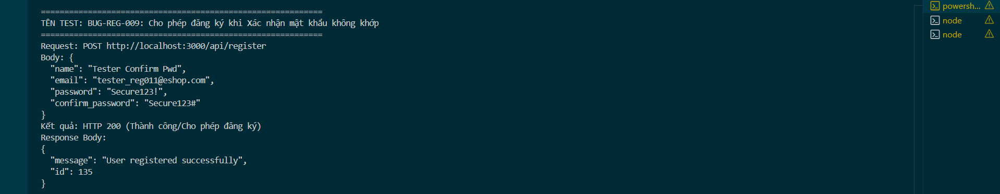

Title: [BUG][Register] Cho phép đăng ký khi Xác nhận mật khẩu không khớp

## Found by Test Case
TC-REG-011

## Requirement liên quan
FR-01: Account registration (Phải có trường Xác nhận mật khẩu — hệ thống từ chối nếu hai trường không khớp)

## Severity / Priority
Critical / P0

## Environment
Backend Node.js API, SQLite Database

## Steps to reproduce
1. Gọi API POST đăng ký đến `/api/register` với mật khẩu xác nhận không khớp (Ví dụ: `"password": "Secure123!"`, `"confirm_password": "Secure123#"`):
   ```json
   {
     "name": "Tester Confirm Pwd",
     "email": "tester_reg011@eshop.com",
     "password": "Secure123!",
     "confirm_password": "Secure123#"
   }
   ```

## Expected result
- Hệ thống từ chối đăng ký, trả về HTTP 400 Bad Request.
- Hiển thị thông báo lỗi cụ thể: "Mật khẩu xác nhận không khớp".

## Actual result
- Hệ thống trả về HTTP 200 OK và đăng ký thành công.

## Evidence


---
*Nhãn (Labels) cần gắn:* `type: bug`, `module: register`, `severity: critical`, `priority: P0`, `status: new`, `found-by: test-case`
