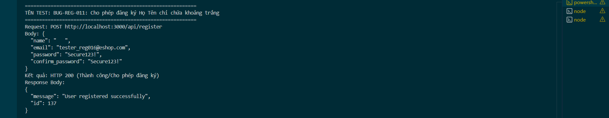

Title: [BUG][Register] Cho phép đăng ký Họ Tên chỉ chứa khoảng trắng

## Found by Test Case
TC-REG-016

## Requirement liên quan
FR-01: Account registration (Họ Tên không được để trống)

## Severity / Priority
Major / P1

## Environment
Backend Node.js API, SQLite Database

## Steps to reproduce
1. Gọi API POST đến `/api/register` với Họ Tên chỉ chứa các khoảng trắng (Ví dụ: `"name": "   "`):
   ```json
   {
     "name": "   ",
     "email": "tester_reg016@eshop.com",
     "password": "Secure123!",
     "confirm_password": "Secure123!"
   }
   ```

## Expected result
- Hệ thống từ chối đăng ký, trả về HTTP 400 Bad Request.
- Hiển thị thông báo lỗi: "Họ tên không được để trống".

## Actual result
- Hệ thống trả về HTTP 200 OK và đăng ký thành công cho tài khoản có Họ Tên chỉ chứa toàn khoảng trắng.

## Evidence


---
*Nhãn (Labels) cần gắn:* `type: bug`, `module: register`, `severity: major`, `priority: P1`, `status: new`, `found-by: test-case`
