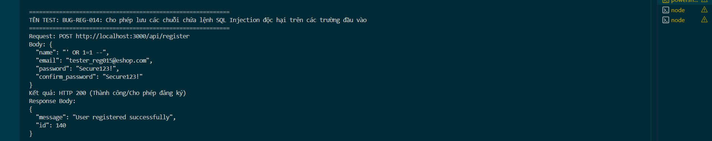

Title: [BUG][Register] Cho phép lưu các chuỗi chứa lệnh SQL Injection độc hại trên các trường đầu vào

## Found by Test Case
TC-REG-015, TC-REG-036, TC-REG-038, TC-REG-040

## Requirement liên quan
FR-01: Account registration (Hệ thống từ chối áp dụng, báo lỗi không hợp lệ và xử lý chuỗi an toàn chống SQL Injection)

## Severity / Priority
Critical / P0

## Environment
Backend Node.js API, SQLite Database

## Steps to reproduce
1. Gọi API POST đến `/api/register` với Họ Tên chứa SQL Injection payload (Ví dụ: `"name": "' OR 1=1 --"`):
   ```json
   {
     "name": "' OR 1=1 --",
     "email": "tester_reg015@eshop.com",
     "password": "Secure123!",
     "confirm_password": "Secure123!"
   }
   ```
2. Gọi tương tự với các trường `email`, `password`, `confirm_password` chứa SQL Injection payload (Ví dụ: `"email": "' OR 1=1 --@domain.com"` hoặc `"password": "' OR '1'='1"`).

## Expected result
- Hệ thống từ chối đăng ký, trả về HTTP 400 Bad Request.
- Hệ thống xử lý chuỗi an toàn, ngăn chặn việc lưu các ký tự SQL đặc biệt có thể phá vỡ câu truy vấn.

## Actual result
- Hệ thống trả về HTTP 200 OK và đăng ký thành công cho tất cả các payload SQL Injection.
- Các payload độc hại này được lưu nguyên văn vào CSDL SQLite. Dù thao tác đăng ký sử dụng parameterized query để ghi vào CSDL, việc chấp nhận lưu chuỗi SQLi thô làm tăng rủi ro cực cao về lỗ hổng Secondary SQL Injection tại các hàm xử lý dữ liệu ghép chuỗi (concatenation) sau này.

## Evidence


---
*Nhãn (Labels) cần gắn:* `type: bug`, `module: register`, `severity: critical`, `priority: P0`, `status: new`, `found-by: test-case`
