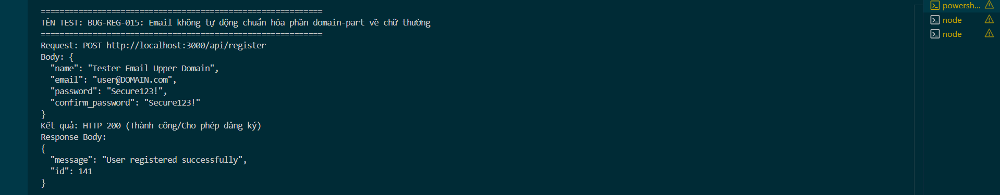

Title: [BUG][Register] Email không tự động chuẩn hóa phần domain-part về chữ thường

## Found by Test Case
TC-REG-031

## Requirement liên quan
FR-01: Account registration (Email có phần domain-part tự động chuyển thành chữ thường hoặc từ chối áp dụng và báo lỗi)

## Severity / Priority
Minor / P3

## Environment
Backend Node.js API, SQLite Database

## Steps to reproduce
1. Gọi API POST đăng ký đến `/api/register` với email chứa chữ in hoa ở domain-part (Ví dụ: `"email": "user@DOMAIN.com"`):
   ```json
   {
     "name": "Tester Email Upper Domain",
     "email": "user@DOMAIN.com",
     "password": "Secure123!",
     "confirm_password": "Secure123!"
   }
   ```

## Expected result
- Email trong CSDL tự động được chuẩn hóa về dạng chữ thường hoàn toàn hoặc domain-part chữ thường (Ví dụ: `"user@domain.com"`), hoặc hệ thống từ chối đăng ký và trả về HTTP 400 Bad Request.

## Actual result
- Hệ thống trả về HTTP 200 OK và đăng ký thành công.
- Lưu nguyên văn chuỗi chưa chuẩn hóa `"user@DOMAIN.com"` vào database, gây mất nhất quán dữ liệu và khó khăn cho việc tra cứu/so khớp tài khoản sau này.

## Evidence


---
*Nhãn (Labels) cần gắn:* `type: bug`, `module: register`, `severity: minor`, `priority: P3`, `status: new`, `found-by: test-case`
