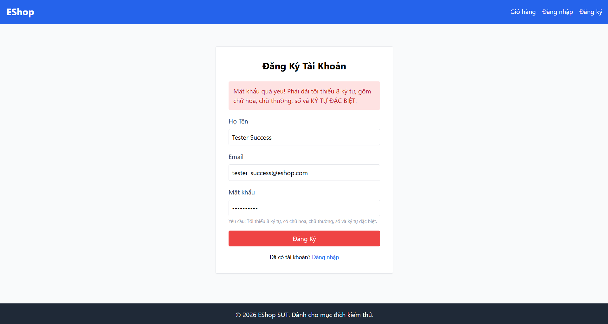

Title: [BUG][Register][Frontend] Lỗi regex mật khẩu mạnh ở Frontend chặn ký tự đặc biệt thực tế và thiếu trường xác nhận mật khẩu

## Found by Test Case
TC-REG-042

## Requirement liên quan
FR-01: Account registration (Yêu cầu mật khẩu mạnh, có trường Xác nhận mật khẩu)

## Severity / Priority
High / P1

## Environment
Frontend Web (Vite + React), Chrome / Firefox / Edge

## Steps to reproduce
1. Truy cập trang đăng ký ở Frontend Web.
2. Nhập Họ Tên: `"Tester Web"`
3. Nhập Email: `"tester_web@eshop.com"`
4. Nhập Mật khẩu mạnh chứa ký tự đặc biệt thực tế (Ví dụ: `"Secure123!"` hoặc `"P@ssword1"`).
5. Nhấp nút "Đăng Ký".

## Expected result
- Hệ thống thực hiện gửi yêu cầu đăng ký lên backend và cho phép đăng ký thành công nếu thông tin hợp lệ.
- Form đăng ký phải có trường "Xác nhận mật khẩu" và so khớp với trường "Mật khẩu" trước khi gửi lên hệ thống.

## Actual result
- Hệ thống không cho đăng ký và hiển thị thông báo lỗi: `"Mật khẩu quá yếu! Phải dài tối thiểu 8 ký tự, gồm chữ hoa, chữ thường, số và KÝ TỰ ĐẶC BIỆT."`
- Form đăng ký ở Frontend Web hoàn toàn không có ô nhập "Xác nhận mật khẩu" (confirm_password).

## Evidence

## Cause analysis (Nguyên nhân)
1. Tại `frontend-web/src/pages/Register.jsx` dòng 16:
   Biểu thức chính quy `flawedStrongPasswordRegex = /^(?=.*[a-z])(?=.*[A-Z])(?=.*\d)(?=.*\s)[A-Za-z\d\s]{8,}$/` bị sai logic:
   - Nó bắt buộc phải có khoảng trắng (`(?=.*\s)`).
   - Nó chỉ chấp nhận chữ cái, số và khoảng trắng `[A-Za-z\d\s]`, dẫn đến việc cấm tất cả các ký tự đặc biệt thực tế như `!`, `@`, `#`, `$`, `%`,...
2. Form đăng ký trong `Register.jsx` thiếu thành phần giao diện cho trường `confirm_password` và không gửi tham số này lên backend API.

---
*Nhãn (Labels) cần gắn:* `type: bug`, `module: register`, `severity: high`, `priority: P1`, `status: new`, `found-by: test-case`
