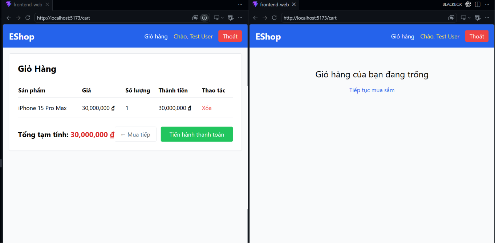

# BUG-FR07-B-03: Frontend CartContext không cộng dồn số lượng khi thêm sản phẩm trùng

| Tên trường (Field) | Giá trị (Value) |
| :--- | :--- |
| **No.** | 03 |
| **BugID** | `BUG-FR07-B-03` |
| **Status** | **Open** |
| **Requirement Name** | FR-07 Giỏ hàng & Điều hướng |
| **Summary** | Tại `frontend-web/src/context/CartContext.jsx`, hàm `addToCart` thêm trực tiếp sản phẩm vào state cart mà không kiểm tra trùng lặp ID, khiến giỏ hàng có nhiều dòng trùng lặp. |
| **Steps to reproduce** | 1. Ở trang chủ, bấm thêm Sản phẩm A.
2. Bấm thêm Sản phẩm A một lần nữa.
3. Đi tới trang Giỏ hàng `/cart`. |
| **Severity** | Major |
| **Frequency** | Always |
| **Priority** | High |
| **Evidence (Screenshot)** |  |
| **Date** | 2026-06-27 |
| **Reporter** | Khoa |
