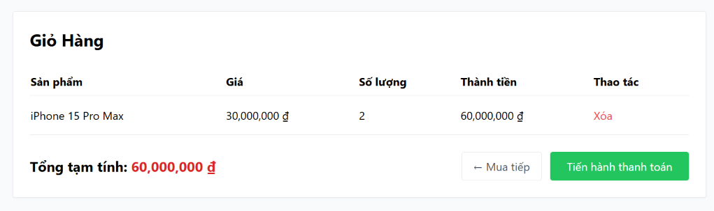

# BUG-FR07-B-04: Trang giỏ hàng thiếu nút tăng giảm số lượng (+/-) và nhập số lượng trực tiếp

| Tên trường (Field) | Giá trị (Value) |
| :--- | :--- |
| **No.** | 04 |
| **BugID** | `BUG-FR07-B-04` |
| **Status** | **Open** |
| **Requirement Name** | FR-07 Giỏ hàng & Điều hướng |
| **Summary** | Trang giỏ hàng `/cart` hiển thị số lượng sản phẩm dưới dạng text tĩnh và không có các nút '+' / '-' hay ô nhập liệu, khiến người dùng không thể điều chỉnh số lượng. |
| **Steps to reproduce** | 1. Thêm sản phẩm vào giỏ hàng.
2. Truy cập `/cart`.
3. Tìm nút '+' hoặc '-' hoặc ô nhập để thay đổi số lượng. |
| **Severity** | Major |
| **Frequency** | Always |
| **Priority** | High |
| **Attachment (Link to file)** | [Cart.jsx](file:///c:/My%20Workspace/HCMUS/Test/Week%203/Hw2/frontend-web/src/pages/Cart.jsx#L47) |
| **Evidence (Screenshot)** |  |
| **Date** | 2026-06-27 |
| **Reporter** | AI Tester (Antigravity) |
