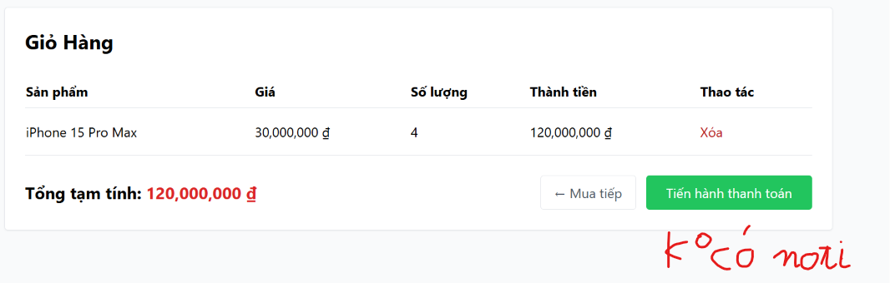

# BUG-FR07-B-05: Thiếu Confirm Dialog xác nhận khi xóa sản phẩm khỏi giỏ hàng

| Tên trường (Field) | Giá trị (Value) |
| :--- | :--- |
| **No.** | 05 |
| **BugID** | `BUG-FR07-B-05` |
| **Status** | **Open** |
| **Requirement Name** | FR-07 Giỏ hàng & Điều hướng |
| **Summary** | Nút 'Xóa' sản phẩm trực tiếp kích hoạt hàm `removeFromCart` xóa bản ghi ngay lập tức mà không hiển thị hộp thoại xác nhận (Confirm Dialog), tăng nguy cơ xóa nhầm dữ liệu. |
| **Steps to reproduce** | 1. Truy cập `/cart` có sản phẩm.
2. Nhấn nút 'Xóa'.
3. Quan sát xem có modal/alert confirm hiển thị hay không. |
| **Severity** | Minor |
| **Frequency** | Always |
| **Priority** | Medium |
| **Evidence (Screenshot)** |  |
| **Date** | 2026-06-27 |
| **Reporter** | Khoa |
