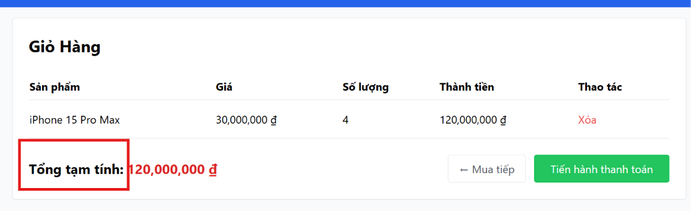

# BUG-FR07-B-06: Nhãn hiển thị tổng tiền không đúng đặc tả ('Tổng tạm tính' thay vì 'Tổng cộng')

| Tên trường (Field) | Giá trị (Value) |
| :--- | :--- |
| **No.** | 06 |
| **BugID** | `BUG-FR07-B-06` |
| **Status** | **Open** |
| **Requirement Name** | FR-07 Giỏ hàng & Điều hướng |
| **Summary** | Trang `/cart` hiển thị nhãn tổng số tiền của giỏ hàng là 'Tổng tạm tính' thay vì 'Tổng cộng' như yêu cầu trong đặc tả. |
| **Steps to reproduce** | 1. Truy cập `/cart` có sản phẩm.
2. Quan sát nhãn văn bản bên cạnh tổng tiền. |
| **Severity** | Minor |
| **Frequency** | Always |
| **Priority** | Low |
| **Evidence (Screenshot)** |  |
| **Date** | 2026-06-27 |
| **Reporter** | Khoa |
