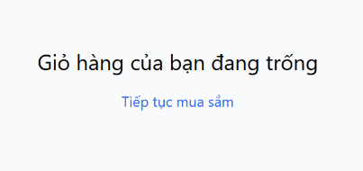

# BUG-FR07-B-07: Trạng thái giỏ hàng trống thiếu hình ảnh/icon minh họa trực quan

| Tên trường (Field) | Giá trị (Value) |
| :--- | :--- |
| **No.** | 07 |
| **BugID** | `BUG-FR07-B-07` |
| **Status** | **Open** |
| **Requirement Name** | FR-07 Giỏ hàng & Điều hướng |
| **Summary** | Khi giỏ hàng trống, giao diện chỉ hiển thị dòng chữ thông báo và nút quay về mà thiếu hình ảnh hoặc biểu tượng (icon) trực quan minh họa. |
| **Steps to reproduce** | 1. Truy cập `/cart` khi chưa có sản phẩm.
2. Quan sát phần hiển thị empty state. |
| **Severity** | Minor |
| **Frequency** | Always |
| **Priority** | Low |
| **Evidence (Screenshot)** |  |
| **Date** | 2026-06-27 |
| **Reporter** | AI Tester (Antigravity) |
