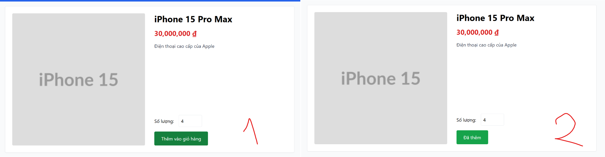

# BUG-FR07-B-11: Thiếu thông báo phản hồi (toast/alert) khi thêm sản phẩm vào giỏ hàng thành công

| Tên trường (Field) | Giá trị (Value) |
| :--- | :--- |
| **No.** | 11 |
| **BugID** | `BUG-FR07-B-11` |
| **Status** | **Open** |
| **Requirement Name** | FR-07 Giỏ hàng & Điều hướng |
| **Summary** | Giao diện không hiển thị bất kỳ thông báo (toast/alert/popup) nào để thông báo cho người dùng biết sản phẩm đã được thêm vào giỏ hàng thành công, vi phạm yêu cầu phản hồi trạng thái của FR-24. |
| **Steps to reproduce** | 1. Truy cập Trang chủ.
2. Nhấn nút 'Thêm vào giỏ hàng' của một sản phẩm.
3. Quan sát màn hình tìm thông báo phản hồi. |
| **Severity** | Minor |
| **Frequency** | Always |
| **Priority** | Medium |
| **Evidence (Screenshot)** |  |
| **Date** | 2026-06-27 |
| **Reporter** | Khoa |
