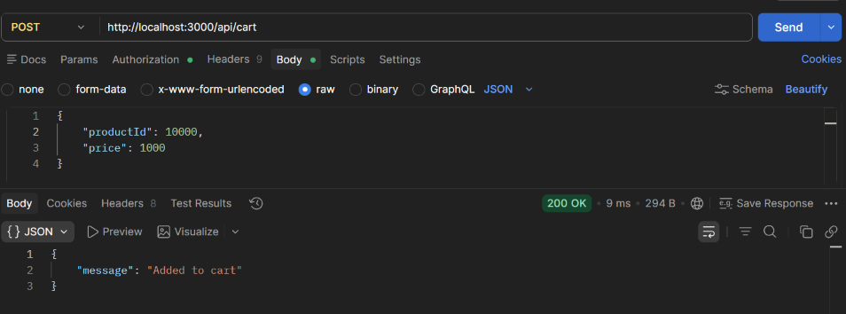

# BUG-FR07-B-14: Backend API chấp nhận productId không tồn tại và tạo ra sản phẩm ma

| Tên trường (Field) | Giá trị (Value) |
| :--- | :--- |
| **No.** | 14 |
| **BugID** | `BUG-FR07-B-14` |
| **Status** | **Open** |
| **Requirement Name** | FR-07 Giỏ hàng & Điều hướng |
| **Summary** | API `POST /api/cart` không kiểm tra sự tồn tại của sản phẩm (`productId`) trong bảng cơ sở dữ liệu `products`, dẫn đến việc thêm các sản phẩm không có thực hoặc sai tên vào giỏ hàng. |
| **Steps to reproduce** | 1. Đăng nhập.
2. Gửi request POST tới `/api/cart` với body chứa `productId: 999999` (không tồn tại).
3. Kiểm tra phản hồi trả về từ API. |
| **Severity** | Major |
| **Frequency** | Always |
| **Priority** | High |
| **Evidence (Screenshot)** |  |
| **Date** | 2026-06-27 |
| **Reporter** | Khoa |
