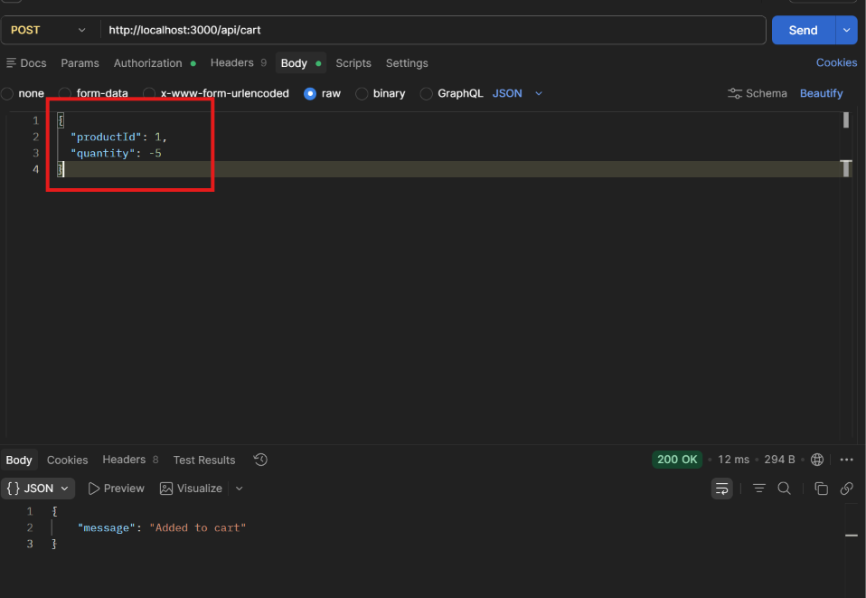

# BUG-FR07-B-19: Giỏ hàng không được làm sạch sau khi thanh toán thành công (checkout success)

| Tên trường (Field) | Giá trị (Value) |
| :--- | :--- |
| **No.** | 19 |
| **BugID** | `BUG-FR07-B-19` |
| **Status** | **Open** |
| **Requirement Name** | FR-08 Thanh toán |
| **Summary** | Tại giao diện thanh toán `/checkout` của `frontend-web`, hàm `handleCheckout` sau khi thanh toán thành công không thực hiện gọi hàm `clearCart()` để làm trống giỏ hàng, khiến các sản phẩm đã thanh toán vẫn hiển thị trong giỏ hàng. |
| **Steps to reproduce** | 1. Đăng nhập và thêm sản phẩm vào giỏ hàng. 2. Nhấn nút Thanh toán để chuyển sang trang `/checkout`. 3. Bấm nút Thanh toán trên trang checkout để hoàn thành đơn hàng. 4. Nhận thông báo 'Thanh toán thành công!'. 5. Nhấp nút 'Quay lại trang chủ' và mở lại trang giỏ hàng `/cart`. |
| **Severity** | Major |
| **Frequency** | Always |
| **Priority** | High |
| **Evidence (Screenshot)** |  |
| **Date** | 2026-06-28 |
| **Reporter** | Khoa |
