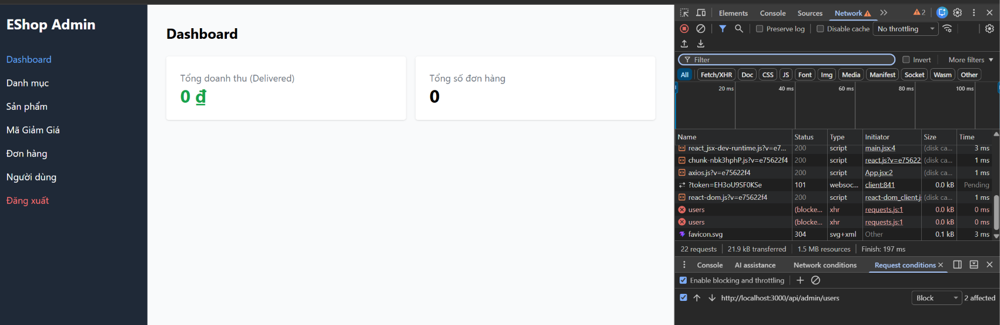

# BUG-FR13-C-03: Lỗi API /api/admin/users 500 ngắt toàn bộ tiến trình fetchData của dashboard
 
| Tên trường (Field) | Giá trị (Value) |
| :--- | :--- |
| **No.** | 03 |
| **BugID** | `BUG-FR13-C-03` |
| **Status** | **Open** |
| **Requirement Name** | FR-13 Dashboard (Robustness) |
| **Summary** | Tại `frontend-admin/src/App.jsx:41-59`, hàm `fetchData` thực hiện nhiều cuộc gọi API tuần tự bằng `await` trong cùng một khối `try-catch`. Khi một API (ví dụ: `/admin/users`) trả về lỗi 500, khối `try-catch` sẽ bắt lỗi và ngắt tiến trình `fetchData` ngay lập tức, khiến các API phía sau như `/admin/orders` không được thực thi. Điều này làm hỏng toàn bộ hiển thị số liệu Dashboard. |
| **Steps to reproduce** | 1. Đăng nhập admin. 2. Giả lập/mock API `/api/admin/users` trả về lỗi HTTP 500. 3. Truy cập Dashboard. 4. Quan sát số liệu ở các card doanh thu, đơn hàng, danh mục (chúng sẽ trống trơn hoặc giữ giá trị cũ thay vì hiển thị dữ liệu thực tế). |
| **Severity** | Medium |
| **Frequency** | Always |
| **Priority** | Medium |
| **Evidence (Screenshot)** |  |
| **Date** | 2026-06-28 |
| **Reporter** | Khoa |
