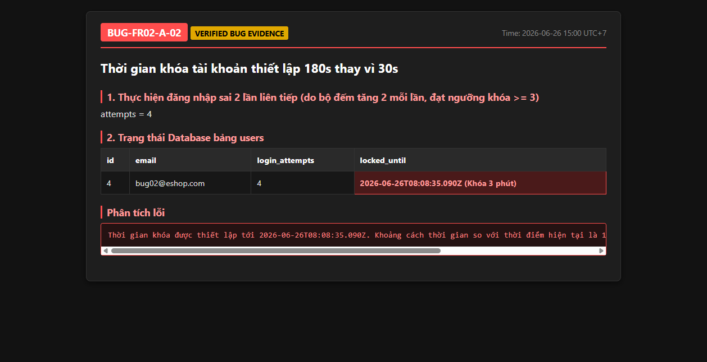

# BUG-FR02-A-02: Thời gian khóa tài khoản bị thiết lập sai thành 3 phút

| Tên trường (Field) | Giá trị (Value) |
| :--- | :--- |
| **No.** | 02 |
| **BugID** | `BUG-FR02-A-02` |
| **Status** | **Open** |
| **Requirement Name** | FR-02 Đăng nhập & Khóa tài khoản |
| **Summary** | Khi tài khoản đăng nhập sai đạt ngưỡng, thời gian khóa bị đặt là 180000 ms (3 phút) thay vì 30000 ms (30 giây) theo đặc tả môi trường demo. |
| **Steps to reproduce** | 1. Thực hiện đăng nhập sai liên tiếp cho đến khi tài khoản bị khóa. 2. Đọc giá trị cột `locked_until` trong DB và so sánh hiệu số thời gian với thời điểm hiện tại. |
| **Severity** | Medium |
| **Frequency** | Always |
| **Priority** | High |
| **Attachment (Link to file)** | [server.js](file:///c:/My%20Workspace/HCMUS/Test/Week%203/Hw2/backend/server.js#L60) |
| **Evidence (Screenshot)** |  |
| **Date** | 2026-06-23 |
| **Reporter** | AI Tester (Antigravity) |
