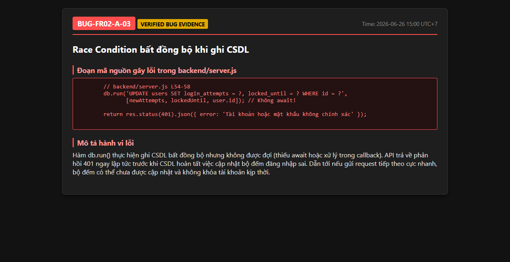

# BUG-FR02-A-03: Race condition do ghi CSDL bất đồng bộ

| Tên trường (Field) | Giá trị (Value) |
| :--- | :--- |
| **No.** | 03 |
| **BugID** | `BUG-FR02-A-03` |
| **Status** | **Open** |
| **Requirement Name** | FR-02 Đăng nhập & Khóa tài khoản |
| **Summary** | Backend trả về phản hồi HTTP ngay lập tức mà không đợi giao dịch ghi database `db.run` hoàn thành, dẫn đến việc đọc dữ liệu kế tiếp bị sai lệch. |
| **Steps to reproduce** | 1. Gửi request đăng nhập sai mật khẩu. 2. Truy vấn DB ngay khi nhận lời gọi phản hồi từ API đăng nhập sai. 3. Kiểm tra trường `login_attempts` vẫn nhận giá trị cũ vì giao dịch chưa hoàn tất ghi. |
| **Severity** | Major |
| **Frequency** | Intermittent |
| **Priority** | High |
| **Attachment (Link to file)** | [server.js](file:///c:/My%20Workspace/HCMUS/Test/Week%203/Hw2/backend/server.js#L62-L69) |
| **Evidence (Screenshot)** |  |
| **Date** | 2026-06-23 |
| **Reporter** | AI Tester (Antigravity) |
