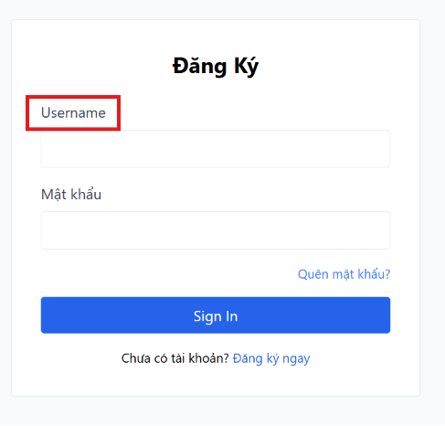

# BUG-FR02-A-05: Trường nhập Email hiển thị nhãn là "Username"

| Tên trường (Field) | Giá trị (Value) |
| :--- | :--- |
| **No.** | 05 |
| **BugID** | `BUG-FR02-A-05` |
| **Status** | **Open** |
| **Requirement Name** | FR-02 Đăng nhập & Khóa tài khoản |
| **Summary** | Trường nhập thông tin định danh hiển thị nhãn là `"Username"` thay vì `"Email"`. |
| **Steps to reproduce** | 1. Truy cập trang đăng nhập `/login`. 2. Nhìn nhãn mô tả của ô nhập liệu đầu tiên. |
| **Severity** | Minor |
| **Frequency** | Always |
| **Priority** | Medium |
| **Evidence (Screenshot)** |  |
| **Date** | 2026-06-23 |
| **Reporter** | AI Tester (Antigravity) |
