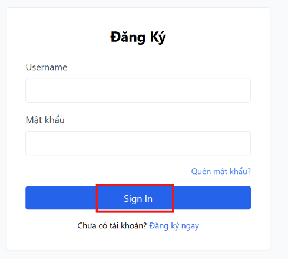

# BUG-FR02-A-06: Nút submit biểu mẫu sử dụng tiếng Anh "Sign In"

| Tên trường (Field) | Giá trị (Value) |
| :--- | :--- |
| **No.** | 06 |
| **BugID** | `BUG-FR02-A-06` |
| **Status** | **Open** |
| **Requirement Name** | FR-21 Tiêu chuẩn Giao diện Chung |
| **Summary** | Giao diện nút gửi biểu mẫu hiển thị tiếng Anh `"Sign In"` thay vì tiếng Việt `"Đăng nhập"`. |
| **Steps to reproduce** | 1. Xem trang đăng nhập `/login`. 2. Đọc văn bản hiển thị trên nút submit chính của form. |
| **Severity** | Minor |
| **Frequency** | Always |
| **Priority** | Medium |
| **Evidence (Screenshot)** |  |
| **Date** | 2026-06-23 |
| **Reporter** | AI Tester (Antigravity) |
