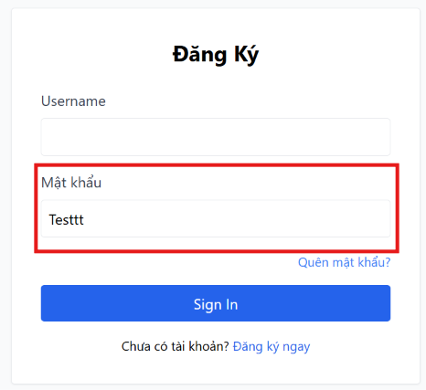

# BUG-FR02-A-07: Mật khẩu hiển thị ở dạng plain text (type="text")

| Tên trường (Field) | Giá trị (Value) |
| :--- | :--- |
| **No.** | 07 |
| **BugID** | `BUG-FR02-A-07` |
| **Status** | **Open** |
| **Requirement Name** | FR-22 Form Requirements |
| **Summary** | Trường nhập mật khẩu cấu hình `type="text"`, khiến ký tự nhập vào hiển thị rõ ràng trên màn hình, vi phạm nghiêm trọng tính bảo mật. |
| **Steps to reproduce** | 1. Nhập mật khẩu vào trường mật khẩu trên form đăng nhập. 2. Các ký tự hiển thị rõ và không được che ẩn dạng dấu chấm. |
| **Severity** | Critical |
| **Frequency** | Always |
| **Priority** | High |
| **Attachment (Link to file)** | [Login.jsx](file:///c:/My%20Workspace/HCMUS/Test/Week%203/Hw2/frontend-web/src/pages/Login.jsx#L52) |
| **Evidence (Screenshot)** |  |
| **Date** | 2026-06-23 |
| **Reporter** | AI Tester (Antigravity) |
