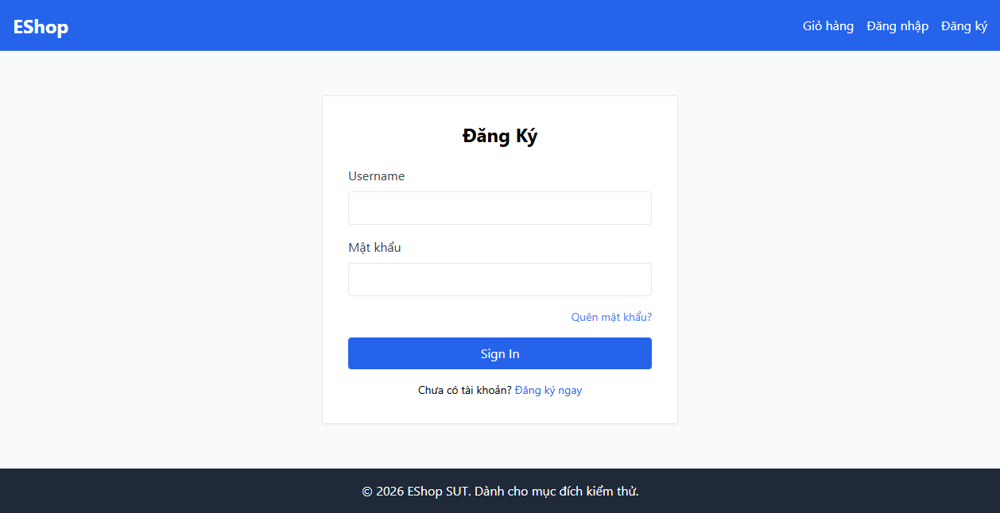

# BUG-FR02-A-11: Nút submit không hiển thị Loading và không bị khóa khi đang xử lý

| Tên trường (Field) | Giá trị (Value) |
| :--- | :--- |
| **No.** | 11 |
| **BugID** | `BUG-FR02-A-11` |
| **Status** | **Open** |
| **Requirement Name** | FR-24 Feedback & State Requirements |
| **Summary** | Trong quá trình gửi request đăng nhập lên API, nút submit không hiển thị trạng thái đang xoay/chờ và người dùng có thể bấm nhiều lần liên tục. |
| **Steps to reproduce** | 1. Nhấp nút Đăng nhập. 2. Nút vẫn giữ nguyên chữ "Đăng nhập" và không bị disabled trong quá trình xử lý gửi API. |
| **Severity** | Minor |
| **Frequency** | Always |
| **Priority** | Medium |
| **Evidence (Screenshot)** |  |
| **Date** | 2026-06-23 |
| **Reporter** | AI Tester (Antigravity) |
