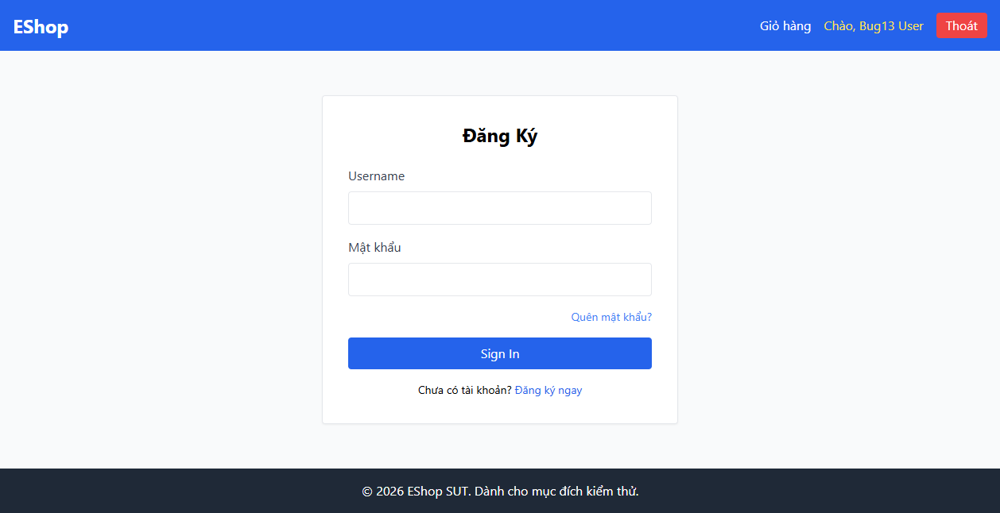

# BUG-FR02-A-14: Thiếu Route Guard ngăn truy cập lại trang Login khi đã đăng nhập

| Tên trường (Field) | Giá trị (Value) |
| :--- | :--- |
| **No.** | 14 |
| **BugID** | `BUG-FR02-A-14` |
| **Status** | **Open** |
| **Requirement Name** | FR-23 Navigation Requirements |
| **Summary** | Người dùng đã đăng nhập thành công vẫn có thể gõ trực tiếp URL `/login` để truy cập lại trang đăng nhập bình thường mà không bị redirect về Home. |
| **Steps to reproduce** | 1. Thực hiện đăng nhập thành công. 2. Thay đổi đường dẫn URL trên trình duyệt thành `/login`. 3. Trang biểu mẫu đăng nhập vẫn hiển thị bình thường. |
| **Severity** | Medium |
| **Frequency** | Always |
| **Priority** | Medium |
| **Attachment (Link to file)** | [App.jsx](file:///c:/My%20Workspace/HCMUS/Test/Week%203/Hw2/frontend-web/src/App.jsx#L52) |
| **Evidence (Screenshot)** |  |
| **Date** | 2026-06-23 |
| **Reporter** | AI Tester (Antigravity) |
