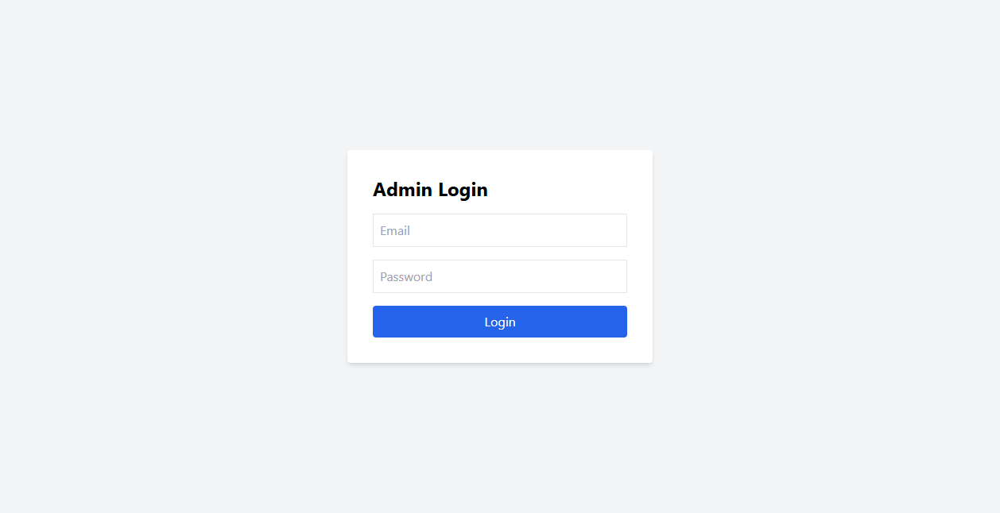

# BUG-FR02-A-16: Thông báo lỗi đăng nhập Admin sử dụng alert() gây hiển thị chữ "Code" và vi phạm vị trí thông báo

| Tên trường (Field) | Giá trị (Value) |
| :--- | :--- |
| **No.** | 16 |
| **BugID** | `BUG-FR02-A-16` |
| **Status** | **Open** |
| **Requirement Name** | FR-02 Đăng nhập & Khóa tài khoản, FR-22 Form Requirements |
| **Summary** | Khi đăng nhập thất bại tại trang Admin (`http://localhost:5174/`), hệ thống sử dụng hàm `alert()` mặc định của trình duyệt để hiển thị lỗi. Việc này khiến tiêu đề hộp thoại hiển thị chữ `"Code"` (hoặc tên miền chạy local), đồng thời vi phạm đặc tả **FR-22** (yêu cầu thông báo lỗi phải hiển thị dạng chữ phía trên nút submit). |
| **Steps to reproduce** | 1. Truy cập trang đăng nhập Web Admin tại `http://localhost:5174/`. 2. Nhập thông tin tài khoản sai (ví dụ: `wrong@eshop.com` / `WrongPass123`). 3. Bấm nút submit. 4. Quan sát hộp thoại thông báo lỗi hiện lên trên màn hình. |
| **Severity** | Major |
| **Frequency** | Always |
| **Priority** | Medium |
| **Attachment (Link to file)** | [App.jsx](file:///c:/My%20Workspace/HCMUS/Test/Week%203/Hw2/frontend-admin/src/App.jsx#L71-L73) |
| **Evidence (Screenshot)** |  |
| **Date** | 2026-06-26 |
| **Reporter** | AI Tester (Antigravity) |
