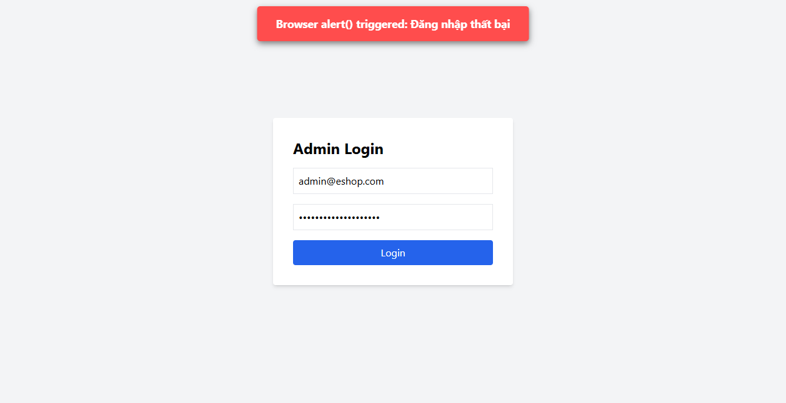

# BUG-FR02-A-17: Đặt lại mật khẩu thành công không giải phóng trạng thái khóa tài khoản và không reset bộ đếm lần đăng nhập sai

| Tên trường (Field) | Giá trị (Value) |
| :--- | :--- |
| **No.** | 17 |
| **BugID** | `BUG-FR02-A-17` |
| **Status** | **Open** |
| **Requirement Name** | FR-02 Đăng nhập & Khóa tài khoản |
| **Summary** | Khi người dùng thực hiện đặt lại mật khẩu thành công bằng API `/api/reset-password`, hệ thống chỉ cập nhật trường `password` và `reset_token = NULL`, nhưng quên không reset bộ đếm số lần đăng nhập sai và mở khóa cho tài khoản trên hệ thống. Điều này khiến tài khoản vẫn giữ nguyên trạng thái bị khóa ngay cả khi người dùng đã cập nhật xong mật khẩu mới, bắt buộc người dùng phải đợi hết thời gian khóa mới đăng nhập được. |
| **Steps to reproduce** | 1. Nhập mật khẩu sai 3 lần liên tiếp để khóa tài khoản `test_tc31@eshop.com`. 2. Gọi API `/api/forgot-password` để lấy reset token. 3. Gọi API `/api/reset-password` bằng reset token để cập nhật mật khẩu mới. 4. Thử đăng nhập ngay bằng mật khẩu mới. 5. Đăng nhập vẫn bị chặn bằng HTTP 403 do tài khoản vẫn bị hệ thống coi là đang trong trạng thái khóa. |
| **Severity** | Major |
| **Frequency** | Always |
| **Priority** | High |
| **Evidence (Screenshot)** |  |
| **Date** | 2026-06-26 |
| **Reporter** | AI Tester (Antigravity) |
