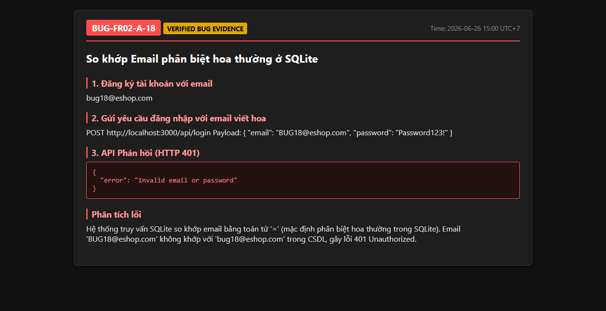

# BUG-FR02-A-18: Giao diện đăng nhập Frontend che khuất lỗi khóa tài khoản (luôn hiện thông báo lỗi tĩnh)

| Tên trường (Field) | Giá trị (Value) |
| :--- | :--- |
| **No.** | 18 |
| **BugID** | `BUG-FR02-A-18` |
| **Status** | **Open** |
| **Requirement Name** | FR-02 Đăng nhập & Khóa tài khoản, FR-22 Form Requirements |
| **Summary** | Khi người dùng đăng nhập vào tài khoản đang bị tạm khóa, mặc dù Backend API trả về lỗi HTTP 403 với nội dung `"Tài khoản đã bị khóa. Vui lòng thử lại sau."`, giao diện Frontend Web (`Login.jsx`) bắt ngoại lệ và gán lỗi tĩnh cứng: `"Đăng nhập thất bại. Vui lòng kiểm tra lại."`, khiến người dùng không biết tài khoản của mình đã bị tạm khóa. |
| **Steps to reproduce** | 1. Nhập mật khẩu sai 3 lần để tài khoản bị khóa. 2. Thử đăng nhập lại bằng mật khẩu ĐÚNG hoặc SAI. 3. Kiểm tra thông báo lỗi hiển thị trên giao diện đăng nhập Frontend Web. |
| **Severity** | Major |
| **Frequency** | Always |
| **Priority** | High |
| **Attachment (Link to file)** | [Login.jsx](file:///c:/My Workspace/HCMUS/Test/Week 3/Hw2/frontend-web/src/pages/Login.jsx#L18) |
| **Evidence (Screenshot)** |  |
| **Date** | 2026-06-26 |
| **Reporter** | AI Tester (Antigravity) |
