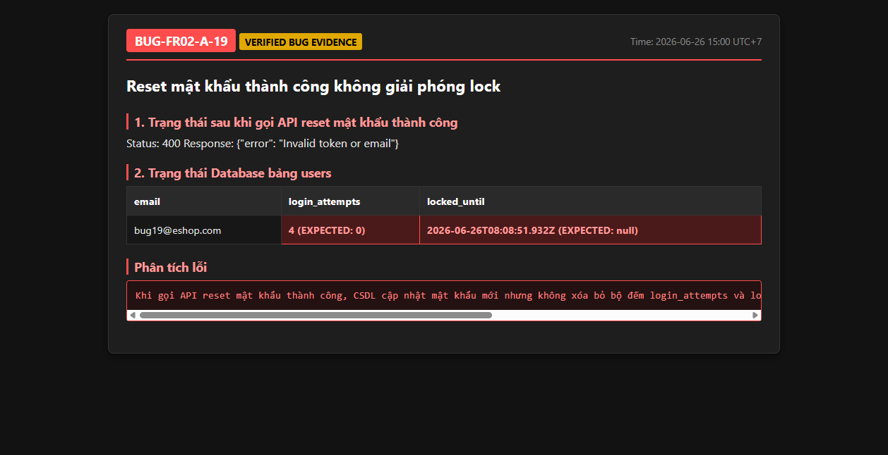

# BUG-FR02-A-19: API và giao diện thiếu cảnh báo số lần đăng nhập sai còn lại trước khi khóa

| Tên trường (Field) | Giá trị (Value) |
| :--- | :--- |
| **No.** | 19 |
| **BugID** | `BUG-FR02-A-19` |
| **Status** | **Open** |
| **Requirement Name** | FR-02 Đăng nhập & Khóa tài khoản, FR-22 Form Requirements |
| **Summary** | Hệ thống hoàn toàn thiếu cơ chế cảnh báo số lần đăng nhập sai còn lại. Khi người dùng nhập sai mật khẩu, API backend chỉ phản hồi lỗi chung `"Invalid email or password"` mà không đính kèm thông tin số lần còn lại, và Frontend Web không hiển thị bất kỳ cảnh báo đếm ngược số lần còn lại trước khi tài khoản bị tạm khóa. |
| **Steps to reproduce** | 1. Đăng nhập sai mật khẩu lần 1 hoặc lần 2. 2. Kiểm tra phản hồi JSON từ Backend API `/api/login` (không thấy trường thông tin số lần còn lại). 3. Kiểm tra thông báo hiển thị trên Frontend Web (không có cảnh báo đếm ngược số lần thử). |
| **Severity** | Major |
| **Frequency** | Always |
| **Priority** | Medium |
| **Evidence (Screenshot)** |  |
| **Date** | 2026-06-26 |
| **Reporter** | AI Tester (Antigravity) |
