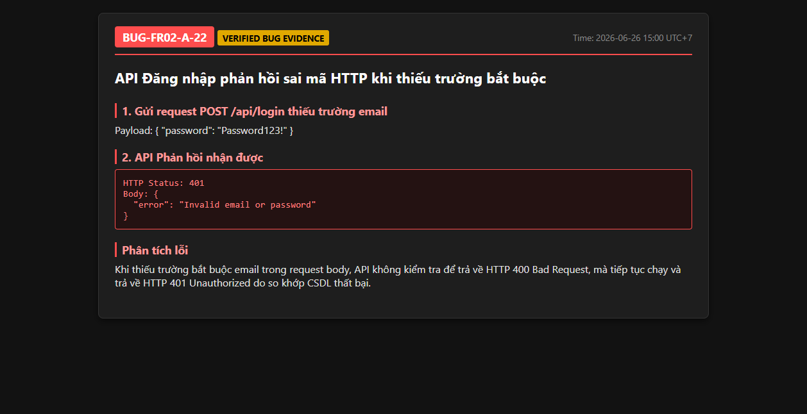

# BUG-FR02-A-22: API Đăng nhập (/api/login) phản hồi sai mã HTTP khi thiếu trường bắt buộc

| Tên trường (Field) | Giá trị (Value) |
| :--- | :--- |
| **No.** | 22 |
| **BugID** | `BUG-FR02-A-22` |
| **Status** | **Open** |
| **Requirement Name** | FR-02 Đăng nhập & Khóa tài khoản |
| **Summary** | Khi gửi yêu cầu đăng nhập POST tới `/api/login` nhưng thiếu trường `email` hoặc `password` trong request body, API không thực hiện kiểm tra cấu trúc dữ liệu bắt buộc để trả về HTTP 400 Bad Request, mà trực tiếp chạy truy vấn CSDL và so khớp mật khẩu rỗng, sau đó trả về HTTP 401 Unauthorized. |
| **Steps to reproduce** | 1. Sử dụng Postman hoặc curl gửi yêu cầu POST tới `/api/login` với body: `{"password": "ValidPassword1!"}` (thiếu trường email). 2. Xem kết quả phản hồi HTTP nhận được từ API. 3. Kết quả trả về HTTP 401 Unauthorized thay vì HTTP 400 Bad Request. |
| **Severity** | Minor |
| **Frequency** | Always |
| **Priority** | Low |
| **Attachment (Link to file)** | [server.js](file:///c:/My%20Workspace/HCMUS/Test/Week%203/Hw2/backend/server.js#L35) |
| **Evidence (Screenshot)** |  |
| **Date** | 2026-06-26 |
| **Reporter** | AI Tester (Antigravity) |
