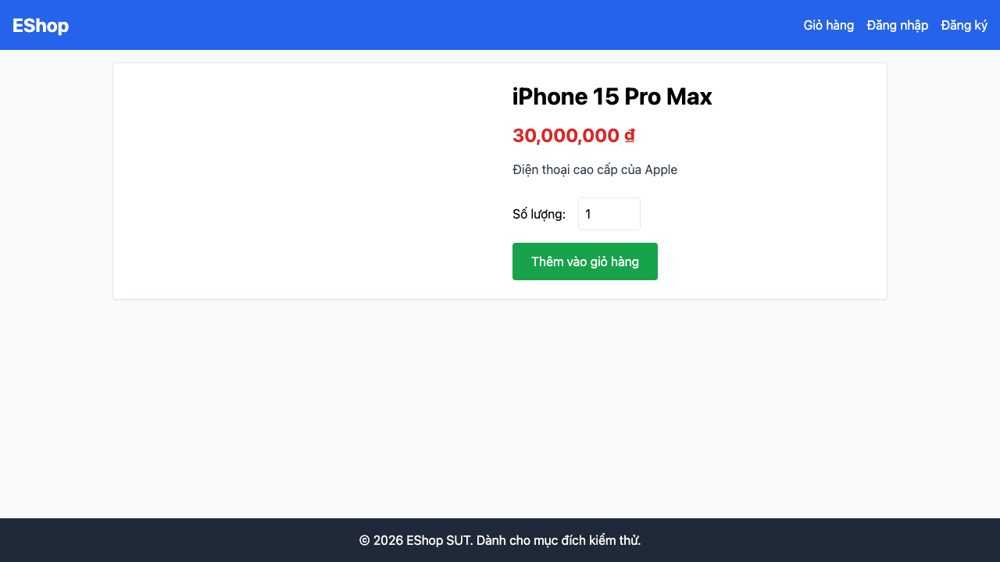

# GUI-IA01-04: Mọi nút hành động tích cực đồng nhất màu xanh dương

## Requirement ID
FR-21 (nhất quán màu sắc)

## Module / Test type / Technique
Giao diện chung (General UI) / GUI/Usability / Checklist-based GUI Testing

## Checklist coverage
| Thuộc tính | Giá trị |
| :--- | :--- |
| Checklist ID | GUI-IA01-04 |
| Interface Aspect | Giao diện chung (General UI) |
| Actor | Người dùng cuối (khách) |
| Goal | Mọi nút hành động tích cực đồng nhất màu xanh dương. |
| Screen(s) | Chi tiết SP, Giỏ hàng, Thanh toán, Quên MK |
| Checklist item | Các nút tích cực ("Thêm vào giỏ hàng", "Tiến hành thanh toán", "Xác Nhận Thanh Toán", "Áp dụng", "Đặt lại mật khẩu" — hiện xanh lá/cam) dùng màu xanh dương theo spec. |
| Traced to | FR-21 (nhất quán màu sắc) |

## Preconditions
- SUT đang chạy (`run_servers.sh`); Frontend Web khách hàng tại `localhost:5173`, backend tại `localhost:3000`.
- Đã đăng nhập bằng tài khoản `test@eshop.com` / `Test1234!`.
- Giỏ hàng có sẵn ít nhất 1 sản phẩm.

## Test data
| Tham số | Giá trị thử nghiệm |
| :--- | :--- |
| Actor | Người dùng cuối (khách) |
| Interface | Frontend Web (khách) — UI |
| Endpoint / UI flow | /product/:id , /cart , /checkout , /forgot-password |
| Input / Payload | Không có (quan sát tĩnh) |
| Fixture | Sản phẩm seed id=1 |

## Test steps
1. Mở lần lượt Chi tiết SP, Giỏ hàng, Thanh toán, Quên mật khẩu (bước 2).
2. Quan sát màu nền các nút hành động tích cực.
3. Ghi Fail cho từng nút không phải xanh dương.

## Expected result
- Tất cả nút hành động tích cực trên 4 màn hình có màu xanh dương thống nhất.

## Status / Related bugs
Failed — BUG-07 (https://github.com/trngnneee/eshop-sut/issues/200)

## Actual result
- Executed by: Đặng Trường Nguyên
- Execution date: 2026-07-25
- Execution interface: Frontend Web (khách) — kiểm thử thủ công trên trình duyệt Chrome
- Observed: Nút "Thêm vào giỏ hàng" (Chi tiết SP) màu rgb(22, 163, 74) — xanh lá, không phải xanh dương. Các nút tích cực khác (thanh toán xanh lá, áp mã cam) cũng lệch spec.
- Execution result: **Failed**
- Screenshot: 
