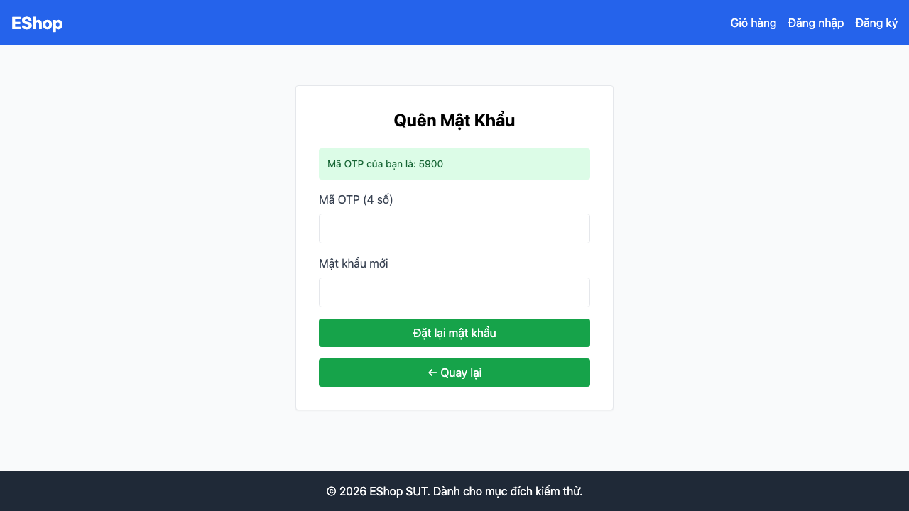

# GUI-IA01-05: Nút phụ phân biệt rõ với nút hành động chính

## Requirement ID
Heuristic (visual hierarchy)

## Module / Test type / Technique
Giao diện chung (General UI) / GUI/Usability / Checklist-based GUI Testing

## Checklist coverage
| Thuộc tính | Giá trị |
| :--- | :--- |
| Checklist ID | GUI-IA01-05 |
| Interface Aspect | Giao diện chung (General UI) |
| Actor | Người dùng cuối (khách) |
| Goal | Nút phụ phân biệt rõ với nút hành động chính. |
| Screen(s) | Quên mật khẩu |
| Checklist item | Nút phụ "← Quay lại" (bước 2) phân biệt thị giác với nút chính "Đặt lại mật khẩu" (hiện cùng bg-green-600, full-width — ForgotPassword.jsx:91-96). |
| Traced to | Heuristic (visual hierarchy) |

## Preconditions
- SUT đang chạy (`run_servers.sh`); Frontend Web khách hàng tại `localhost:5173`, backend tại `localhost:3000`.

## Test data
| Tham số | Giá trị thử nghiệm |
| :--- | :--- |
| Actor | Người dùng cuối (khách) |
| Interface | Frontend Web (khách) — UI |
| Endpoint / UI flow | /forgot-password |
| Input / Payload | Email hợp lệ để sang bước 2 |
| Fixture | Tài khoản test@eshop.com |

## Test steps
1. Mở `/forgot-password`, nhập email và bấm "Lấy mã OTP" để sang bước 2.
2. Quan sát style 2 nút "Đặt lại mật khẩu" và "← Quay lại".
3. Đánh giá mức độ phân biệt thị giác.

## Expected result
- Nút "← Quay lại" có style thứ cấp (viền/xám), khác rõ với nút submit.
- Người dùng không thể nhầm nút phụ với nút hành động chính.

## Status / Related bugs
Failed — BUG-26 (https://github.com/trngnneee/eshop-sut/issues/219)

## Actual result
- Executed by: Đặng Trường Nguyên
- Execution date: 2026-07-25
- Execution interface: Frontend Web (khách) — kiểm thử thủ công trên trình duyệt Chrome
- Observed: Nút chính "Đặt lại mật khẩu" (rgb(22, 163, 74)) và nút phụ "← Quay lại" (rgb(22, 163, 74)) cùng nền xanh lá, full-width — không phân biệt được thị giác.
- Execution result: **Failed**
- Screenshot: 
