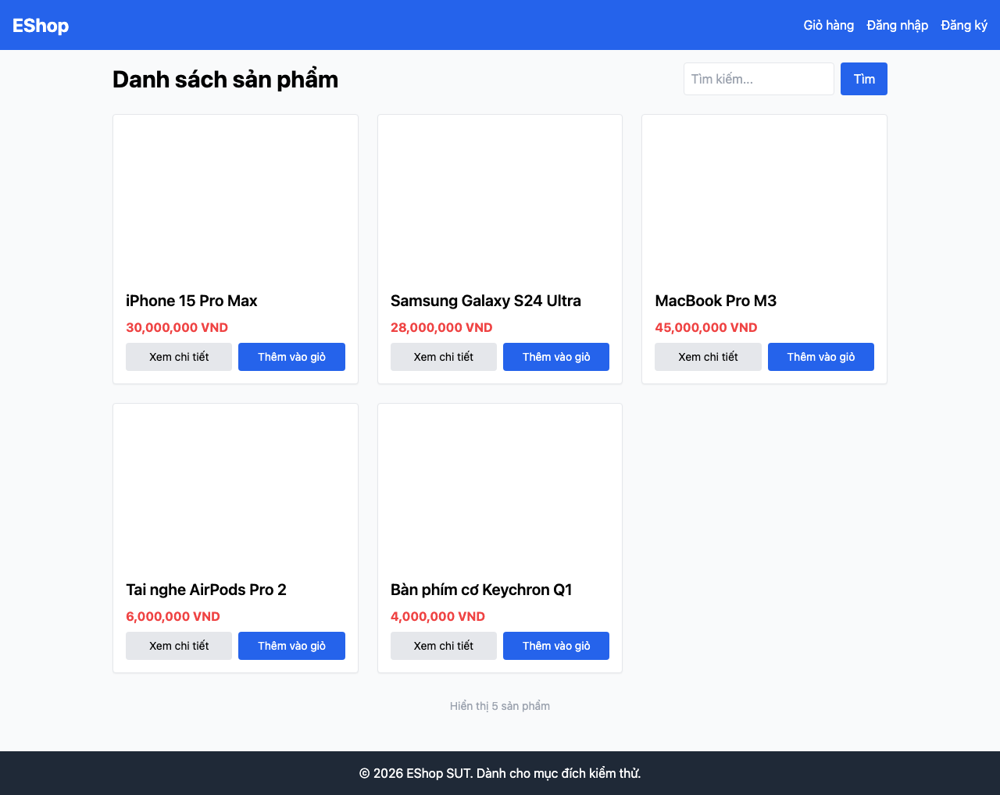

# GUI-IA01-06: Mọi giá dùng ký hiệu ₫ thống nhất toàn app

## Requirement ID
FR-21 (nhất quán đơn vị tiền)

## Module / Test type / Technique
Giao diện chung (General UI) / GUI/Usability / Checklist-based GUI Testing

## Checklist coverage
| Thuộc tính | Giá trị |
| :--- | :--- |
| Checklist ID | GUI-IA01-06 |
| Interface Aspect | Giao diện chung (General UI) |
| Actor | Người dùng cuối (khách) |
| Goal | Mọi giá dùng ký hiệu ₫ thống nhất toàn app. |
| Screen(s) | Trang chủ |
| Checklist item | Giá trên card dùng ký hiệu `₫` (hiện là "VND" — Home.jsx:87-89; các màn khác dùng ₫). |
| Traced to | FR-21 (nhất quán đơn vị tiền) |

## Preconditions
- SUT đang chạy (`run_servers.sh`); Frontend Web khách hàng tại `localhost:5173`, backend tại `localhost:3000`.

## Test data
| Tham số | Giá trị thử nghiệm |
| :--- | :--- |
| Actor | Người dùng cuối (khách) |
| Interface | Frontend Web (khách) — UI |
| Endpoint / UI flow | / |
| Input / Payload | Không có (quan sát tĩnh) |
| Fixture | Sản phẩm seed id=1..5 |

## Test steps
1. Mở `localhost:5173/`.
2. Quan sát đơn vị tiền trên card sản phẩm.
3. Đối chiếu với ký hiệu ₫ ở Chi tiết SP / Giỏ hàng.

## Expected result
- Giá trên card sản phẩm hiển thị dạng `30.000.000 ₫`.
- Không dùng "VND" trong khi các màn khác dùng ₫.

## Status / Related bugs
Failed — xem screenshot & Issue liên quan

## Actual result
- Executed by: Đặng Trường Nguyên
- Execution date: 2026-07-25
- Execution interface: Frontend Web (khách) — Playwright/Chromium
- Execution tool: Playwright (Chromium headless) — tự động hoá
- Observed: Giá trên card trang chủ hiển thị "30,000,000 VND" dùng "VND", trong khi các màn khác dùng ký hiệu ₫ — không nhất quán.
- Execution result: **Failed**
- Screenshot: 
