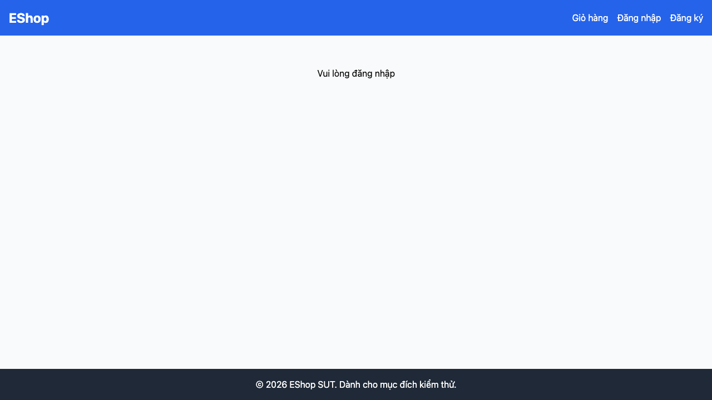

# GUI-IA01-10: Mỗi trang có đúng 1 h1 mô tả nội dung

## Requirement ID
FR-21 (tiêu đề trang)

## Module / Test type / Technique
Giao diện chung (General UI) / GUI/Usability / Checklist-based GUI Testing

## Checklist coverage
| Thuộc tính | Giá trị |
| :--- | :--- |
| Checklist ID | GUI-IA01-10 |
| Interface Aspect | Giao diện chung (General UI) |
| Actor | Người dùng cuối (khách) |
| Goal | Mỗi trang có đúng 1 h1 mô tả nội dung. |
| Screen(s) | Đăng nhập, Đăng ký, Quên MK, Giỏ hàng, Thanh toán, Hồ sơ/ĐH |
| Checklist item | Mỗi trang có đúng 1 h1 mô tả nội dung (6 trang này chỉ có h2, không có h1). |
| Traced to | FR-21 (tiêu đề trang) |

## Preconditions
- SUT đang chạy (`run_servers.sh`); Frontend Web khách hàng tại `localhost:5173`, backend tại `localhost:3000`.
- Đã đăng nhập bằng tài khoản `test@eshop.com` / `Test1234!`.
- Giỏ hàng có sẵn ít nhất 1 sản phẩm.

## Test data
| Tham số | Giá trị thử nghiệm |
| :--- | :--- |
| Actor | Người dùng cuối (khách) |
| Interface | Frontend Web (khách) — DevTools Elements |
| Endpoint / UI flow | /login , /register , /forgot-password , /cart , /checkout , /profile |
| Input / Payload | Không có |
| Fixture | Không cần |

## Test steps
1. Mở lần lượt 6 màn hình.
2. Chạy `document.querySelectorAll('h1').length` cho từng trang.
3. Fail nếu trang nào ≠ 1 thẻ h1.

## Expected result
- Mỗi trong 6 trang có đúng 1 thẻ `<h1>` mô tả đúng nội dung trang.

## Status / Related bugs
Failed — xem screenshot & Issue liên quan

## Actual result
- Executed by: Đặng Trường Nguyên
- Execution date: 2026-07-25
- Execution interface: Frontend Web (khách) — Playwright/Chromium
- Execution tool: Playwright (Chromium headless) — tự động hoá
- Observed: Số thẻ <h1> mỗi trang: /login=0, /register=0, /forgot-password=0, /cart=0, /checkout=0, /profile=0 — các trang này chỉ có <h2>, thiếu <h1> mô tả nội dung.
- Execution result: **Failed**
- Screenshot: 
