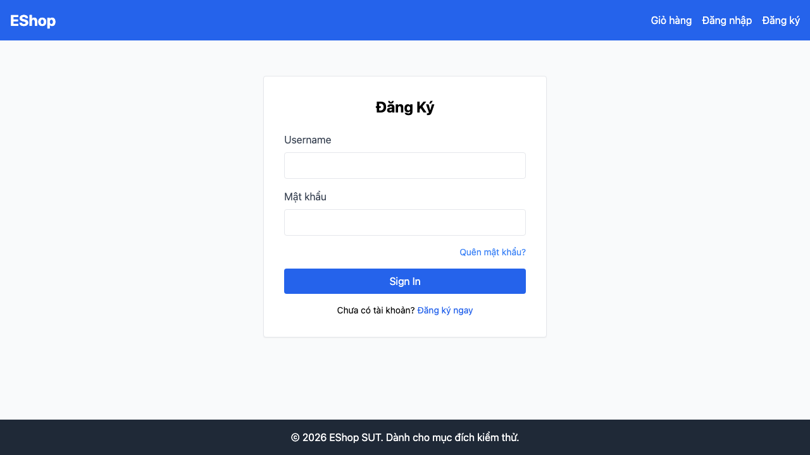

# GUI-IA01-13: Thứ tự Tab trên mọi form đi trên-xuống, submit cuối cùng

## Requirement ID
FR-21 (tab order)

## Module / Test type / Technique
Giao diện chung (General UI) / GUI/Usability / Checklist-based GUI Testing

## Checklist coverage
| Thuộc tính | Giá trị |
| :--- | :--- |
| Checklist ID | GUI-IA01-13 |
| Interface Aspect | Giao diện chung (General UI) |
| Actor | Người dùng cuối (khách) |
| Goal | Thứ tự Tab trên mọi form đi trên-xuống, submit cuối cùng. |
| Screen(s) | Đăng nhập, Đăng ký, Quên MK, Thanh toán, Hồ sơ |
| Checklist item | Tab order mọi form đi trên-xuống, field đầu → nút submit cuối, không có tabIndex phá thứ tự (Đăng nhập hiện có tabIndex={1} trên nút — Login.jsx:56 → focus nút TRƯỚC input). |
| Traced to | FR-21 (tab order) |

## Preconditions
- SUT đang chạy (`run_servers.sh`); Frontend Web khách hàng tại `localhost:5173`, backend tại `localhost:3000`.
- Đã đăng nhập bằng tài khoản `test@eshop.com` / `Test1234!`.
- Giỏ hàng có sẵn ít nhất 1 sản phẩm.

## Test data
| Tham số | Giá trị thử nghiệm |
| :--- | :--- |
| Actor | Người dùng cuối (khách) |
| Interface | Frontend Web (khách) — thao tác bàn phím |
| Endpoint / UI flow | /login , /register , /forgot-password , /checkout , /profile |
| Input / Payload | Phím Tab |
| Fixture | Không cần |

## Test steps
1. Mở từng form, đặt con trỏ ra ngoài rồi nhấn Tab liên tục.
2. Ghi lại thứ tự phần tử được focus.
3. Fail nếu nút submit được focus trước các input (vd form Đăng nhập).

## Expected result
- Tab lần lượt qua các field theo thứ tự thị giác, nút submit được focus cuối cùng.
- Không field/nút nào bị nhảy thứ tự do tabIndex.

## Status / Related bugs
Failed — xem screenshot & Issue liên quan

## Actual result
- Executed by: Đặng Trường Nguyên
- Execution date: 2026-07-25
- Execution interface: Frontend Web (khách) — Playwright/Chromium
- Execution tool: Playwright (Chromium headless) — tự động hoá
- Observed: Nút submit form Đăng nhập có tabindex="1" → được focus TRƯỚC các ô input, phá thứ tự Tab tự nhiên.
- Execution result: **Failed**
- Screenshot: 
