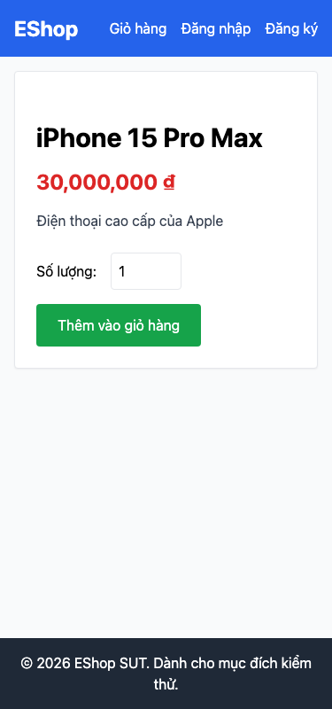

# GUI-IA01-14: Nút thêm giỏ hiển thị đầy đủ trên mobile

## Requirement ID
Heuristic (responsive)

## Module / Test type / Technique
Giao diện chung (General UI) / GUI/Usability / Checklist-based GUI Testing

## Checklist coverage
| Thuộc tính | Giá trị |
| :--- | :--- |
| Checklist ID | GUI-IA01-14 |
| Interface Aspect | Giao diện chung (General UI) |
| Actor | Người dùng cuối (khách) |
| Goal | Nút thêm giỏ hiển thị đầy đủ trên mobile. |
| Screen(s) | Chi tiết SP |
| Checklist item | Viewport ≤640px: nút "Thêm vào giỏ hàng" hiển thị đầy đủ (class bug-mobile-hidden áp margin-right:-100px — index.css:10-14). |
| Traced to | Heuristic (responsive) |

## Preconditions
- SUT đang chạy (`run_servers.sh`); Frontend Web khách hàng tại `localhost:5173`, backend tại `localhost:3000`.

## Test data
| Tham số | Giá trị thử nghiệm |
| :--- | :--- |
| Actor | Người dùng cuối (khách) |
| Interface | Frontend Web (khách) — DevTools device toolbar |
| Endpoint / UI flow | /product/:id |
| Input / Payload | Viewport 375px |
| Fixture | Sản phẩm seed id=1 |

## Test steps
1. Mở `/product/1`, bật DevTools device toolbar, chọn 375px.
2. Quan sát vị trí nút "Thêm vào giỏ hàng".
3. Fail nếu nút bị lệch/tràn ra ngoài khung.

## Expected result
- Ở 375px, nút "Thêm vào giỏ hàng" nằm trọn trong khung, bấm được.
- Không gây tràn ngang layout.

## Status / Related bugs
Failed — xem screenshot & Issue liên quan

## Actual result
- Executed by: Đặng Trường Nguyên
- Execution date: 2026-07-25
- Execution interface: Frontend Web (khách) — Playwright/Chromium @375px
- Execution tool: Playwright (Chromium headless) — tự động hoá
- Observed: Ở viewport 375px, nút "Thêm vào giỏ hàng" có margin-right -100px (class bug-mobile-hidden) → bị đẩy lệch/tràn khỏi khung.
- Execution result: **Failed**
- Screenshot: 
