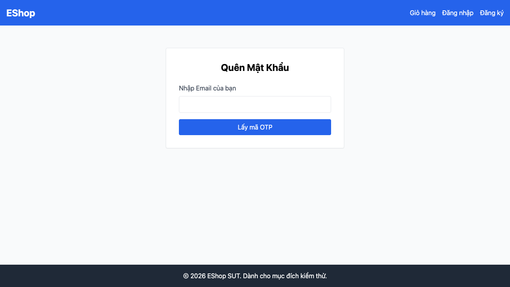

# GUI-IA02-02: Field Email dùng type=email, chặn định dạng sai

## Requirement ID
FR-22 (input type)

## Module / Test type / Technique
Biểu mẫu (Forms) / GUI/Usability / Checklist-based GUI Testing

## Checklist coverage
| Thuộc tính | Giá trị |
| :--- | :--- |
| Checklist ID | GUI-IA02-02 |
| Interface Aspect | Biểu mẫu (Forms) |
| Actor | Người dùng cuối (khách) |
| Goal | Field Email dùng type=email, chặn định dạng sai. |
| Screen(s) | Đăng ký, Đăng nhập, Quên MK |
| Checklist item | Field Email dùng `type="email"` (hiện cả 3 là `type="text"`); nhập "abc" phải bị chặn. |
| Traced to | FR-22 (input type) |

## Preconditions
- SUT đang chạy (`run_servers.sh`); Frontend Web khách hàng tại `localhost:5173`, backend tại `localhost:3000`.

## Test data
| Tham số | Giá trị thử nghiệm |
| :--- | :--- |
| Actor | Người dùng cuối (khách) |
| Interface | Frontend Web (khách) — UI + DevTools |
| Endpoint / UI flow | /register , /login , /forgot-password |
| Input / Payload | Chuỗi "abc" trong ô email |
| Fixture | Không cần |

## Test steps
1. Mở từng form, kiểm tra thuộc tính type của ô email (DevTools).
2. Nhập "abc" và submit.
3. Fail nếu form nhận giá trị không phải email.

## Expected result
- 3 field email có `type="email"`.
- Submit với "abc" (không phải email) bị trình duyệt chặn.

## Status / Related bugs
Failed — BUG-10 (https://github.com/trngnneee/eshop-sut/issues/203)

## Actual result
- Executed by: Đặng Trường Nguyên
- Execution date: 2026-07-25
- Execution interface: Frontend Web (khách) — kiểm thử thủ công trên trình duyệt Chrome
- Observed: Field email dùng type: {"/register":"text","/login":"text","/forgot-password":"text"} — đang là "text" thay vì "email", không chặn định dạng sai ở tầng trình duyệt.
- Execution result: **Failed**
- Screenshot: 
