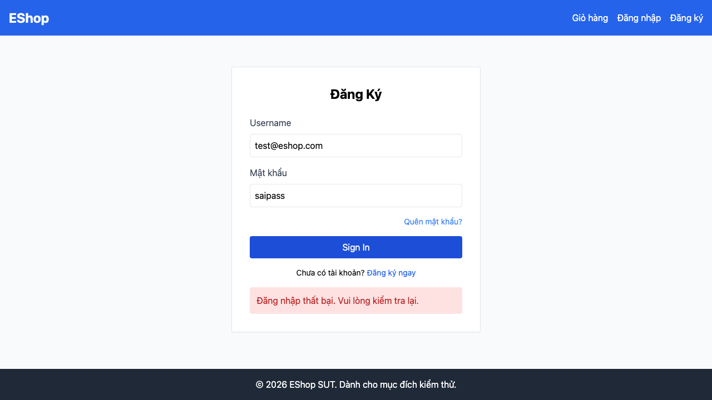

# GUI-IA02-04: Mọi lỗi form hiện trong trang, phía TRÊN nút submit (theo spec, dù ngược thói quen)

## Requirement ID
FR-22 (message placement — ngược convention)

## Module / Test type / Technique
Biểu mẫu (Forms) / GUI/Usability / Checklist-based GUI Testing

## Checklist coverage
| Thuộc tính | Giá trị |
| :--- | :--- |
| Checklist ID | GUI-IA02-04 |
| Interface Aspect | Biểu mẫu (Forms) |
| Actor | Người dùng cuối (khách) |
| Goal | Mọi lỗi form hiện trong trang, phía TRÊN nút submit (theo spec, dù ngược thói quen). |
| Screen(s) | Đăng nhập, Đăng ký, Quên MK, Hồ sơ |
| Checklist item | Mọi thông báo lỗi form hiển thị TRONG TRANG, vị trí phía TRÊN nút submit — đúng spec dù ngược convention (hiện: Đăng nhập lỗi DƯỚI form — Login.jsx:66; Quên MK/Hồ sơ dùng alert() native; Đăng ký đã đúng — Register.jsx:34). |
| Traced to | FR-22 (message placement — ngược convention) |

## Preconditions
- SUT đang chạy (`run_servers.sh`); Frontend Web khách hàng tại `localhost:5173`, backend tại `localhost:3000`.
- Đã đăng nhập bằng tài khoản `test@eshop.com` / `Test1234!`.

## Test data
| Tham số | Giá trị thử nghiệm |
| :--- | :--- |
| Actor | Người dùng cuối (khách) |
| Interface | Frontend Web (khách) — UI |
| Endpoint / UI flow | /login , /register , /forgot-password , /profile |
| Input / Payload | Dữ liệu sai để kích hoạt lỗi (vd sai mật khẩu, SĐT sai) |
| Fixture | Tài khoản test@eshop.com |

## Test steps
1. Mở từng form, nhập dữ liệu gây lỗi rồi submit.
2. Quan sát lỗi là in-page hay alert() native, và vị trí so với nút submit.
3. Fail nếu dùng alert() hoặc lỗi nằm dưới nút submit.

## Expected result
- Lỗi hiển thị là thành phần trong trang (không phải alert() native).
- Vị trí lỗi nằm PHÍA TRÊN nút submit.
- Chấm theo spec, KHÔNG chấp nhận pattern "lỗi dưới field".

## Status / Related bugs
Failed — xem screenshot & Issue liên quan

## Actual result
- Executed by: Đặng Trường Nguyên
- Execution date: 2026-07-25
- Execution interface: Frontend Web (khách) — Playwright/Chromium
- Execution tool: Playwright (Chromium headless) — tự động hoá
- Observed: Thông báo lỗi đăng nhập nằm DƯỚI nút submit (errY=517, btnY=425) — ngược yêu cầu FR-22 (lỗi phải phía TRÊN nút submit). Quên MK/Hồ sơ còn dùng alert() native.
- Execution result: **Failed**
- Screenshot: 
