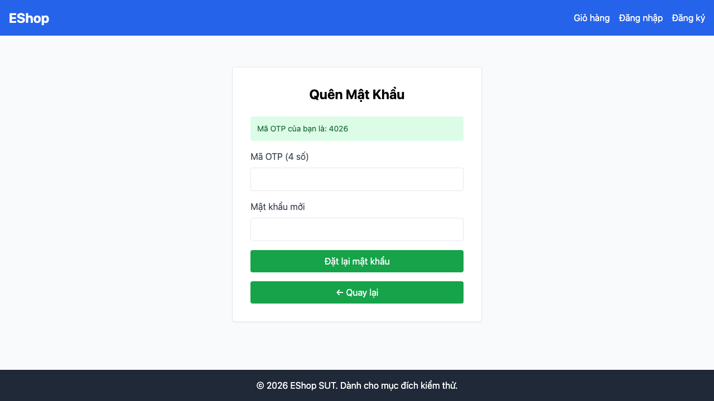

# GUI-IA02-05: Luồng 2 bước có step indicator rõ ràng

## Requirement ID
FR-22 (step indicator)

## Module / Test type / Technique
Biểu mẫu (Forms) / GUI/Usability / Checklist-based GUI Testing

## Checklist coverage
| Thuộc tính | Giá trị |
| :--- | :--- |
| Checklist ID | GUI-IA02-05 |
| Interface Aspect | Biểu mẫu (Forms) |
| Actor | Người dùng cuối (khách) |
| Goal | Luồng 2 bước có step indicator rõ ràng. |
| Screen(s) | Quên mật khẩu |
| Checklist item | Luồng 2 bước có Step Indicator rõ ràng (hiện không có — ForgotPassword.jsx:46-98). |
| Traced to | FR-22 (step indicator) |

## Preconditions
- SUT đang chạy (`run_servers.sh`); Frontend Web khách hàng tại `localhost:5173`, backend tại `localhost:3000`.

## Test data
| Tham số | Giá trị thử nghiệm |
| :--- | :--- |
| Actor | Người dùng cuối (khách) |
| Interface | Frontend Web (khách) — UI |
| Endpoint / UI flow | /forgot-password |
| Input / Payload | Email hợp lệ để chuyển bước |
| Fixture | Tài khoản test@eshop.com |

## Test steps
1. Mở `/forgot-password` (bước 1), tìm chỉ dẫn bước.
2. Bấm "Lấy mã OTP" sang bước 2, tìm chỉ dẫn bước.
3. Fail nếu không có step indicator ở cả 2 bước.

## Expected result
- Hiển thị chỉ dẫn bước hiện tại (vd "Bước 1/2", "Bước 2/2").

## Status / Related bugs
Failed — BUG-29 (https://github.com/trngnneee/eshop-sut/issues/222)

## Actual result
- Executed by: Đặng Trường Nguyên
- Execution date: 2026-07-25
- Execution interface: Frontend Web (khách) — kiểm thử thủ công trên trình duyệt Chrome
- Observed: Luồng Quên mật khẩu 2 bước không có Step Indicator ở cả bước 1 lẫn bước 2 (không có chỉ dẫn "Bước 1/2", "Bước 2/2").
- Execution result: **Failed**
- Screenshot: 
