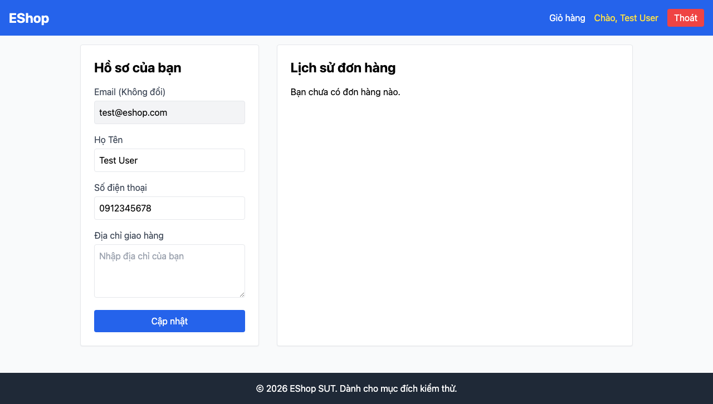

# GUI-IA02-06: Field SĐT chấp nhận số VN 10 số bắt đầu bằng 0

## Requirement ID
FR-22 (format constraints: phone)

## Module / Test type / Technique
Biểu mẫu (Forms) / GUI/Usability / Checklist-based GUI Testing

## Checklist coverage
| Thuộc tính | Giá trị |
| :--- | :--- |
| Checklist ID | GUI-IA02-06 |
| Interface Aspect | Biểu mẫu (Forms) |
| Actor | Người dùng cuối (khách) |
| Goal | Field SĐT chấp nhận số VN 10 số bắt đầu bằng 0. |
| Screen(s) | Hồ sơ |
| Checklist item | Field SĐT chấp nhận số VN 10 số bắt đầu bằng 0 (regex hiện từ chối số đầu 0 — Profile.jsx:44 — mâu thuẫn placeholder "0912345678" — :144). |
| Traced to | FR-22 (format constraints: phone) |

## Preconditions
- SUT đang chạy (`run_servers.sh`); Frontend Web khách hàng tại `localhost:5173`, backend tại `localhost:3000`.
- Đã đăng nhập bằng tài khoản `test@eshop.com` / `Test1234!`.

## Test data
| Tham số | Giá trị thử nghiệm |
| :--- | :--- |
| Actor | Người dùng cuối (khách) |
| Interface | Frontend Web (khách) — UI |
| Endpoint / UI flow | /profile |
| Input / Payload | "0912345678" ; "abc" ; "123" |
| Fixture | Tài khoản test@eshop.com |

## Test steps
1. Đăng nhập, mở `/profile`.
2. Nhập "0912345678" vào ô SĐT và bấm Cập nhật.
3. Lặp với "abc" và "123", quan sát thông báo.
4. Fail nếu số hợp lệ bắt đầu bằng 0 bị từ chối.

## Expected result
- Nhập "0912345678" → hợp lệ, cập nhật thành công.
- Nhập chữ/quá ngắn → bị chặn kèm message rõ ràng.

## Status / Related bugs
Failed — xem screenshot & Issue liên quan

## Actual result
- Executed by: Đặng Trường Nguyên
- Execution date: 2026-07-25
- Execution interface: Frontend Web (khách) — Playwright/Chromium
- Execution tool: Playwright (Chromium headless) — tự động hoá
- Observed: Nhập SĐT hợp lệ "0912345678" bị từ chối: "Số điện thoại không hợp lệ. Vui lòng nhập đúng 9-10 chữ số." — regex yêu cầu số đầu 1-9 nên loại số VN bắt đầu bằng 0, mâu thuẫn với placeholder.
- Execution result: **Failed**
- Screenshot: 
