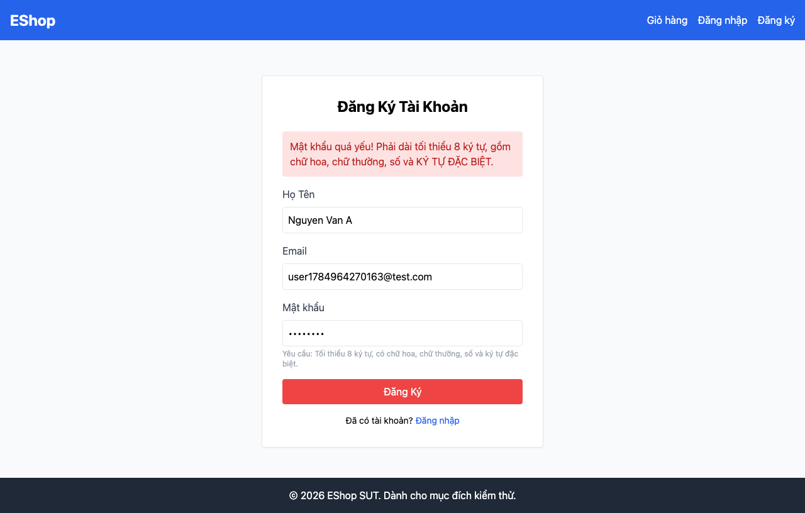

# GUI-IA02-07: Validate mật khẩu khớp với hint mô tả

## Requirement ID
FR-22 (validation) + heuristic

## Module / Test type / Technique
Biểu mẫu (Forms) / GUI/Usability / Checklist-based GUI Testing

## Checklist coverage
| Thuộc tính | Giá trị |
| :--- | :--- |
| Checklist ID | GUI-IA02-07 |
| Interface Aspect | Biểu mẫu (Forms) |
| Actor | Người dùng cuối (khách) |
| Goal | Validate mật khẩu khớp với hint mô tả. |
| Screen(s) | Đăng ký, Quên MK |
| Checklist item | Validate mật khẩu khớp hint: "Abcdef1!" (đủ điều kiện theo hint) phải được chấp nhận (regex hiện yêu cầu khoảng trắng, cấm ký tự đặc biệt — Register.jsx:16-19). |
| Traced to | FR-22 (validation) + heuristic |

## Preconditions
- SUT đang chạy (`run_servers.sh`); Frontend Web khách hàng tại `localhost:5173`, backend tại `localhost:3000`.

## Test data
| Tham số | Giá trị thử nghiệm |
| :--- | :--- |
| Actor | Người dùng cuối (khách) |
| Interface | Frontend Web (khách) — UI |
| Endpoint / UI flow | /register , /forgot-password |
| Input / Payload | Mật khẩu "Abcdef1!" |
| Fixture | Không cần |

## Test steps
1. Mở `/register`, nhập họ tên/email hợp lệ và mật khẩu "Abcdef1!".
2. Bấm Đăng Ký, quan sát có báo "mật khẩu quá yếu" không.
3. Fail nếu mật khẩu đúng như hint bị từ chối.

## Expected result
- Mật khẩu "Abcdef1!" (đủ hoa/thường/số/ký tự đặc biệt như hint) được chấp nhận.
- Quy tắc validate và text hint không mâu thuẫn nhau.

## Status / Related bugs
Failed — BUG-12 (https://github.com/trngnneee/eshop-sut/issues/205)

## Actual result
- Executed by: Đặng Trường Nguyên
- Execution date: 2026-07-25
- Execution interface: Frontend Web (khách) — kiểm thử thủ công trên trình duyệt Chrome
- Observed: Mật khẩu "Abcdef1!" (đủ hoa/thường/số/ký tự đặc biệt như hint) bị từ chối: "Mật khẩu quá yếu! Phải dài tối thiểu 8 ký tự, gồm chữ hoa, chữ thường, số và KÝ TỰ ĐẶC BIỆT." — regex thực tế bắt buộc có khoảng trắng và cấm ký tự đặc biệt, mâu thuẫn với hint.
- Execution result: **Failed**
- Screenshot: 
