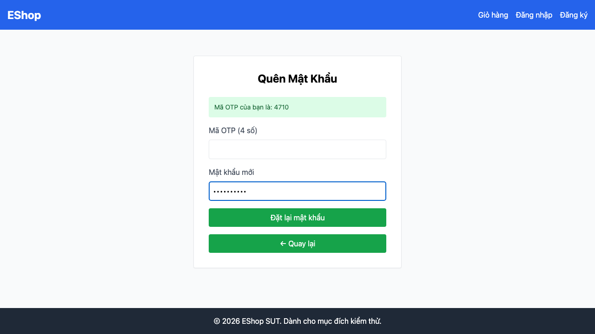

# GUI-IA02-08: Field OTP giới hạn đúng 4 chữ số như nhãn

## Requirement ID
FR-22 (format constraints: OTP)

## Module / Test type / Technique
Biểu mẫu (Forms) / GUI/Usability / Checklist-based GUI Testing

## Checklist coverage
| Thuộc tính | Giá trị |
| :--- | :--- |
| Checklist ID | GUI-IA02-08 |
| Interface Aspect | Biểu mẫu (Forms) |
| Actor | Người dùng cuối (khách) |
| Goal | Field OTP giới hạn đúng 4 chữ số như nhãn. |
| Screen(s) | Quên mật khẩu |
| Checklist item | Field OTP giới hạn đúng 4 chữ số như nhãn (hiện không maxLength/pattern — ForgotPassword.jsx:71-77). |
| Traced to | FR-22 (format constraints: OTP) |

## Preconditions
- SUT đang chạy (`run_servers.sh`); Frontend Web khách hàng tại `localhost:5173`, backend tại `localhost:3000`.

## Test data
| Tham số | Giá trị thử nghiệm |
| :--- | :--- |
| Actor | Người dùng cuối (khách) |
| Interface | Frontend Web (khách) — UI |
| Endpoint / UI flow | /forgot-password |
| Input / Payload | "123456" ; "abcd" |
| Fixture | Tài khoản test@eshop.com |

## Test steps
1. Vào bước 2 của `/forgot-password`.
2. Thử nhập "123456" và "abcd" vào ô Mã OTP.
3. Fail nếu ô nhận quá 4 ký tự hoặc nhận ký tự chữ.

## Expected result
- Không nhập được quá 4 ký tự.
- Không nhập được ký tự không phải số.

## Status / Related bugs
Failed — BUG-30 (https://github.com/trngnneee/eshop-sut/issues/223)

## Actual result
- Executed by: Đặng Trường Nguyên
- Execution date: 2026-07-25
- Execution interface: Frontend Web (khách) — kiểm thử thủ công trên trình duyệt Chrome
- Observed: Ô OTP (nhãn "4 số") nhận giá trị "123456abcd" (dài 10, cả chữ) — không có maxLength/pattern giới hạn 4 chữ số.
- Execution result: **Failed**
- Screenshot: 
